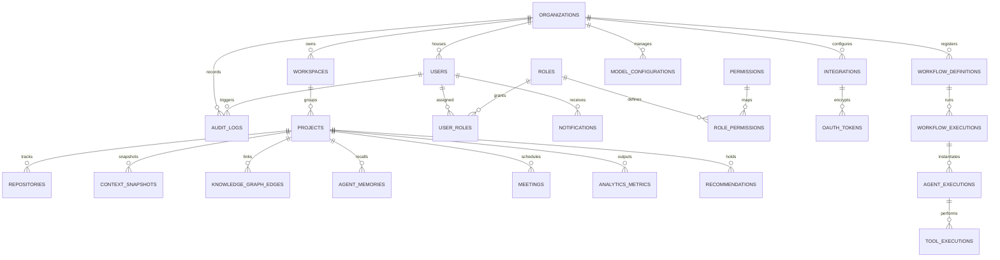

# Database Architecture & Design Specification: AI-Powered TPM

This document outlines the complete relational database architecture, caching, audit tracking, scaling, and migration strategies for the AI-Powered Technical Project Manager (AI-TPM). 

To comply with project specifications, **no DDL or DML SQL statements are generated**. Instead, this document provides structural data types, indexing configurations, schema relationships, partition keys, and metadata schemas.

---

## 1. Complete Entity-Relationship (ER) Diagram



---

## 2. Table Specifications & Attributes

### 1. `organizations`
* **Purpose**: Root tenant container. Isolates all organizational boundaries.
* **Columns**:
  * `id`: UUID (Primary Key)
  * `name`: VARCHAR(255) (Not Null)
  * `domain`: VARCHAR(255) (Unique, Nullable)
  * `created_at`: TIMESTAMP WITH TIME ZONE (Default: NOW())
  * `updated_at`: TIMESTAMP WITH TIME ZONE (Default: NOW())
  * `deleted_at`: TIMESTAMP WITH TIME ZONE (Nullable)
* **Indexes**: B-Tree on `domain` (Filtered: `WHERE deleted_at IS NULL`)
* **Partitioning**: None (Root tenant).
* **Soft Delete**: `deleted_at` timestamp.
* **Retention Policy**: Indefinite.

### 2. `workspaces`
* **Purpose**: Logical division of projects under an organization.
* **Columns**:
  * `id`: UUID (Primary Key)
  * `organization_id`: UUID (Foreign Key -> `organizations.id`, Not Null)
  * `name`: VARCHAR(100) (Not Null)
  * `created_at`: TIMESTAMP WITH TIME ZONE
  * `updated_at`: TIMESTAMP WITH TIME ZONE
  * `deleted_at`: TIMESTAMP WITH TIME ZONE
* **Unique Constraints**: `organization_id` + `name` (Composite, active items only)
* **Indexes**: B-Tree on `organization_id`
* **Soft Delete**: `deleted_at` timestamp.
* **Retention Policy**: Indefinite.

### 3. `users`
* **Purpose**: Core identity information for developers, managers, and system administrators.
* **Columns**:
  * `id`: UUID (Primary Key)
  * `organization_id`: UUID (Foreign Key -> `organizations.id`, Not Null)
  * `email`: VARCHAR(255) (Unique, Not Null)
  * `full_name`: VARCHAR(255) (Not Null)
  * `avatar_url`: TEXT (Nullable)
  * `created_at`: TIMESTAMP WITH TIME ZONE
  * `updated_at`: TIMESTAMP WITH TIME ZONE
  * `deleted_at`: TIMESTAMP WITH TIME ZONE
* **Indexes**: B-Tree on `email`, B-Tree on `organization_id`
* **Soft Delete**: `deleted_at` timestamp.
* **Retention Policy**: Indefinite.

### 4. `roles`
* **Purpose**: List of authorization roles (e.g., `OrgAdmin`, `ProjectManager`, `Developer`, `Reviewer`).
* **Columns**:
  * `id`: UUID (Primary Key)
  * `name`: VARCHAR(50) (Unique, Not Null)
  * `description`: TEXT (Nullable)
  * `created_at`: TIMESTAMP WITH TIME ZONE
* **Indexes**: B-Tree on `name`
* **Soft Delete**: None.
* **Retention Policy**: Indefinite.

### 5. `permissions`
* **Purpose**: Granular permissions (e.g., `repo:write`, `jira:sync`, `workflow:approve`).
* **Columns**:
  * `id`: UUID (Primary Key)
  * `name`: VARCHAR(50) (Unique, Not Null)
  * `description`: TEXT (Nullable)
  * `created_at`: TIMESTAMP WITH TIME ZONE
* **Indexes**: B-Tree on `name`
* **Soft Delete**: None.
* **Retention Policy**: Indefinite.

### 6. `user_roles`
* **Purpose**: Maps users to roles (Many-to-Many).
* **Columns**:
  * `user_id`: UUID (Primary Key, Foreign Key -> `users.id`)
  * `role_id`: UUID (Primary Key, Foreign Key -> `roles.id`)
* **Indexes**: Composite index on `(user_id, role_id)`, index on `role_id`

### 7. `role_permissions`
* **Purpose**: Maps roles to permissions (Many-to-Many).
* **Columns**:
  * `role_id`: UUID (Primary Key, Foreign Key -> `roles.id`)
  * `permission_id`: UUID (Primary Key, Foreign Key -> `permissions.id`)
* **Indexes**: Composite index on `(role_id, permission_id)`

### 8. `projects`
* **Purpose**: Represents the core collaborative units tracking tickets, repository configs, and timelines.
* **Columns**:
  * `id`: UUID (Primary Key)
  * `workspace_id`: UUID (Foreign Key -> `workspaces.id`, Not Null)
  * `name`: VARCHAR(100) (Not Null)
  * `description`: TEXT (Nullable)
  * `created_at`: TIMESTAMP WITH TIME ZONE
  * `updated_at`: TIMESTAMP WITH TIME ZONE
  * `deleted_at`: TIMESTAMP WITH TIME ZONE
* **Indexes**: B-Tree on `workspace_id`
* **Soft Delete**: `deleted_at` timestamp.
* **Retention Policy**: Indefinite.

### 9. `repositories`
* **Purpose**: Code repositories tracked within a project.
* **Columns**:
  * `id`: UUID (Primary Key)
  * `project_id`: UUID (Foreign Key -> `projects.id`, Not Null)
  * `external_repo_id`: VARCHAR(100) (Not Null) -- GitHub Repo ID
  * `name`: VARCHAR(255) (Not Null)
  * `clone_url`: TEXT (Not Null)
  * `created_at`: TIMESTAMP WITH TIME ZONE
  * `updated_at`: TIMESTAMP WITH TIME ZONE
* **Unique Constraints**: `project_id` + `external_repo_id`
* **Indexes**: B-Tree on `project_id`, B-Tree on `external_repo_id`
* **Soft Delete**: None.
* **Retention Policy**: Indefinite.

### 10. `integrations`
* **Purpose**: Tenant connections to external platform accounts.
* **Columns**:
  * `id`: UUID (Primary Key)
  * `organization_id`: UUID (Foreign Key -> `organizations.id`, Not Null)
  * `provider`: VARCHAR(50) (Not Null) -- e.g., 'github', 'jira', 'slack', 'google_calendar'
  * `is_active`: BOOLEAN (Default: TRUE)
  * `created_at`: TIMESTAMP WITH TIME ZONE
  * `updated_at`: TIMESTAMP WITH TIME ZONE
* **Unique Constraints**: `organization_id` + `provider`
* **Indexes**: B-Tree on `organization_id`
* **Soft Delete**: None.
* **Retention Policy**: Indefinite.

### 11. `oauth_tokens`
* **Purpose**: Encrypted credentials and access levels for integrations.
* **Columns**:
  * `id`: UUID (Primary Key)
  * `integration_id`: UUID (Foreign Key -> `integrations.id`, Unique, Not Null)
  * `encrypted_access_token`: TEXT (Not Null)
  * `encrypted_refresh_token`: TEXT (Nullable)
  * `expires_at`: TIMESTAMP WITH TIME ZONE (Nullable)
  * `scopes`: TEXT[] (Nullable)
* **Soft Delete**: None.
* **Retention Policy**: Truncated/Overwritten on credential refresh; deleted when integration is uninstalled.

### 12. `events` (Event Queue Table)
* **Purpose**: Persistent outbox and logging table for the event bus.
* **Columns**:
  * `id`: UUID (Primary Key)
  * `organization_id`: UUID (Foreign Key -> `organizations.id`, Not Null)
  * `routing_key`: VARCHAR(255) (Not Null)
  * `payload`: JSONB (Not Null)
  * `processed`: BOOLEAN (Default: FALSE)
  * `retry_count`: INTEGER (Default: 0)
  * `error_log`: TEXT (Nullable)
  * `created_at`: TIMESTAMP WITH TIME ZONE (Default: NOW())
* **Indexes**: GIN on `payload`, B-Tree on `processed` (Partial: `WHERE processed = FALSE`), B-Tree on `created_at`
* **Partitioning**: Range partition by month on `created_at`.
* **Soft Delete**: None (Hard deleted via retention policies).
* **Retention Policy**: Archive to cold storage (S3) after 90 days.

### 13. `context_snapshots`
* **Purpose**: Snapshots of project states for auditing and historical analysis.
* **Columns**:
  * `id`: UUID (Primary Key)
  * `project_id`: UUID (Foreign Key -> `projects.id`, Not Null)
  * `snapshot_timestamp`: TIMESTAMP WITH TIME ZONE (Default: NOW())
  * `state_payload`: JSONB (Not Null) -- Contains normalized nodes and relationships
  * `summary_embedding`: VECTOR(1536) (Not Null) -- State vector for retrieval
* **Indexes**: IVFFlat or HNSW vector index on `summary_embedding`
* **Partitioning**: Range partition by month on `snapshot_timestamp`.
* **Soft Delete**: None.
* **Retention Policy**: Purge snapshots older than 180 days, retaining only the weekly summary.

### 14. `knowledge_graph_edges`
* **Purpose**: Standardized relationships between development entities.
* **Columns**:
  * `id`: UUID (Primary Key)
  * `project_id`: UUID (Foreign Key -> `projects.id`, Not Null)
  * `source_urn`: VARCHAR(255) (Not Null) -- e.g., 'urn:github:pr:12'
  * `target_urn`: VARCHAR(255) (Not Null) -- e.g., 'urn:jira:issue:PROJ-42'
  * `relation_type`: VARCHAR(100) (Not Null) -- e.g., 'blocked_by', 'assigned_to'
  * `weight`: NUMERIC(3, 2) (Default: 1.0)
  * `created_at`: TIMESTAMP WITH TIME ZONE (Default: NOW())
* **Unique Constraints**: `project_id` + `source_urn` + `target_urn` + `relation_type`
* **Indexes**: B-Tree on `(project_id, source_urn)`, B-Tree on `(project_id, target_urn)`
* **Soft Delete**: None.
* **Retention Policy**: Linked to source items; cleaned up when project components are deleted.

### 15. `agent_memories`
* **Purpose**: Vector database store for agent memory.
* **Columns**:
  * `id`: UUID (Primary Key)
  * `project_id`: UUID (Foreign Key -> `projects.id`, Not Null)
  * `memory_type`: VARCHAR(50) (Not Null) -- e.g., 'long_term', 'project_memory'
  * `content`: TEXT (Not Null)
  * `embedding`: VECTOR(1536) (Not Null)
  * `created_at`: TIMESTAMP WITH TIME ZONE (Default: NOW())
* **Indexes**: HNSW on `embedding` (Cosine similarity search)
* **Soft Delete**: None.
* **Retention Policy**: Kept indefinitely; updated via summarization loops.

### 16. `workflow_definitions`
* **Purpose**: Stores project workflows configured as DAG definitions.
* **Columns**:
  * `id`: UUID (Primary Key)
  * `organization_id`: UUID (Foreign Key -> `organizations.id`, Not Null)
  * `name`: VARCHAR(100) (Not Null)
  * `dag_definition`: JSONB (Not Null) -- Contains tasks, steps, routing, fallback actions
  * `created_at`: TIMESTAMP WITH TIME ZONE
  * `updated_at`: TIMESTAMP WITH TIME ZONE
  * `deleted_at`: TIMESTAMP WITH TIME ZONE
* **Indexes**: B-Tree on `organization_id`, GIN on `dag_definition`
* **Soft Delete**: `deleted_at` timestamp.
* **Retention Policy**: Indefinite.

### 17. `workflow_executions`
* **Purpose**: Execution instances of configured DAGs.
* **Columns**:
  * `id`: UUID (Primary Key)
  * `workflow_definition_id`: UUID (Foreign Key -> `workflow_definitions.id`, Not Null)
  * `status`: VARCHAR(50) (Default: 'pending') -- 'running', 'suspended', 'completed', 'failed', 'cancelled'
  * `execution_state`: JSONB (Not Null) -- Stores active variables and step progress
  * `created_at`: TIMESTAMP WITH TIME ZONE (Default: NOW())
  * `completed_at`: TIMESTAMP WITH TIME ZONE (Nullable)
* **Indexes**: B-Tree on `workflow_definition_id`, B-Tree on `status`
* **Partitioning**: Range partition by month on `created_at`.
* **Soft Delete**: None.
* **Retention Policy**: Retained for 1 year, then archived.

### 18. `notifications`
* **Purpose**: Alerts and approval requests sent to users.
* **Columns**:
  * `id`: UUID (Primary Key)
  * `user_id`: UUID (Foreign Key -> `users.id`, Not Null)
  * `title`: VARCHAR(255) (Not Null)
  * `body`: TEXT (Not Null)
  * `is_read`: BOOLEAN (Default: FALSE)
  * `action_url`: TEXT (Nullable)
  * `created_at`: TIMESTAMP WITH TIME ZONE (Default: NOW())
* **Indexes**: B-Tree on `(user_id, is_read)` (Partial: `WHERE is_read = FALSE`)
* **Soft Delete**: None.
* **Retention Policy**: Deleted after 90 days.

### 19. `meetings`
* **Purpose**: Synchronized calendar event metadata.
* **Columns**:
  * `id`: UUID (Primary Key)
  * `project_id`: UUID (Foreign Key -> `projects.id`, Not Null)
  * `external_event_id`: VARCHAR(255) (Not Null) -- Google Calendar Event ID
  * `title`: VARCHAR(255) (Not Null)
  * `start_time`: TIMESTAMP WITH TIME ZONE (Not Null)
  * `end_time`: TIMESTAMP WITH TIME ZONE (Not Null)
  * `attendees`: JSONB (Not Null) -- List of participant emails and response status
* **Unique Constraints**: `project_id` + `external_event_id`
* **Indexes**: B-Tree on `(project_id, start_time)`
* **Soft Delete**: None.
* **Retention Policy**: Retained for 2 years, then archived.

### 20. `analytics_metrics`
* **Purpose**: Operational metrics collected over time.
* **Columns**:
  * `id`: UUID (Primary Key)
  * `project_id`: UUID (Foreign Key -> `projects.id`, Not Null)
  * `metric_name`: VARCHAR(100) (Not Null) -- e.g., 'velocity', 'cycle_time'
  * `metric_value`: NUMERIC(12, 4) (Not Null)
  * `metadata`: JSONB (Nullable) -- Contextual tags (e.g., developer, repository)
  * `recorded_at`: TIMESTAMP WITH TIME ZONE (Default: NOW())
* **Indexes**: B-Tree on `(project_id, metric_name, recorded_at DESC)`, GIN on `metadata`
* **Partitioning**: Range partition by month on `recorded_at`.
* **Soft Delete**: None.
* **Retention Policy**: Kept for 3 years to support historical analytics.

### 21. `recommendations`
* **Purpose**: AI-generated optimization suggestions and risk warnings.
* **Columns**:
  * `id`: UUID (Primary Key)
  * `project_id`: UUID (Foreign Key -> `projects.id`, Not Null)
  * `title`: VARCHAR(255) (Not Null)
  * `description`: TEXT (Not Null)
  * `recommendation_type`: VARCHAR(100) (Not Null) -- e.g., 'overload', 'risk_delay'
  * `score`: NUMERIC(3, 2) (Not Null) -- Priority ranking
  * `status`: VARCHAR(50) (Default: 'active') -- 'active', 'dismissed', 'accepted'
  * `created_at`: TIMESTAMP WITH TIME ZONE (Default: NOW())
* **Indexes**: B-Tree on `(project_id, status)`
* **Soft Delete**: None.
* **Retention Policy**: Deleted after 60 days if dismissed; retained indefinitely if accepted.

### 22. `audit_logs`
* **Purpose**: Immutable security audit logs.
* **Columns**:
  * `id`: UUID (Primary Key)
  * `organization_id`: UUID (Foreign Key -> `organizations.id`, Not Null)
  * `user_id`: UUID (Foreign Key -> `users.id`, Nullable -- System actions are null)
  * `action`: VARCHAR(100) (Not Null) -- e.g., 'auth:login', 'tool:execute'
  * `details`: JSONB (Not Null)
  * `ip_address`: VARCHAR(45) (Nullable)
  * `created_at`: TIMESTAMP WITH TIME ZONE (Default: NOW())
* **Indexes**: B-Tree on `(organization_id, created_at DESC)`
* **Partitioning**: Range partition by month on `created_at`.
* **Soft Delete**: Prohibited.
* **Retention Policy**: Must be retained for 7 years for compliance. Archived to WORM storage annually.

### 23. `prompt_versions`
* **Purpose**: Tracks system agent prompts.
* **Columns**:
  * `id`: UUID (Primary Key)
  * `agent_type`: VARCHAR(50) (Not Null) -- e.g., 'planning', 'manager'
  * `version`: VARCHAR(20) (Not Null) -- e.g., 'v1.4.2'
  * `prompt_text`: TEXT (Not Null)
  * `created_at`: TIMESTAMP WITH TIME ZONE (Default: NOW())
* **Unique Constraints**: `agent_type` + `version`
* **Indexes**: B-Tree on `(agent_type, version)`
* **Soft Delete**: None.
* **Retention Policy**: Indefinite.

### 24. `model_configurations`
* **Purpose**: Tracks model execution configurations (e.g., temperatures, token limits).
* **Columns**:
  * `id`: UUID (Primary Key)
  * `organization_id`: UUID (Foreign Key -> `organizations.id`, Not Null)
  * `model_name`: VARCHAR(100) (Not Null) -- e.g., 'gpt-4o'
  * `parameters`: JSONB (Not Null) -- e.g., {"temperature": 0.2, "max_tokens": 4000}
  * `created_at`: TIMESTAMP WITH TIME ZONE (Default: NOW())
* **Indexes**: B-Tree on `organization_id`
* **Soft Delete**: None.
* **Retention Policy**: Indefinite.

### 25. `agent_executions`
* **Purpose**: Tracks individual agent executions.
* **Columns**:
  * `id`: UUID (Primary Key)
  * `workflow_execution_id`: UUID (Foreign Key -> `workflow_executions.id`, Nullable)
  * `agent_name`: VARCHAR(50) (Not Null)
  * `status`: VARCHAR(50) (Default: 'running')
  * `thought_log`: TEXT (Nullable)
  * `agent_output`: JSONB (Nullable)
  * `created_at`: TIMESTAMP WITH TIME ZONE (Default: NOW())
* **Indexes**: B-Tree on `workflow_execution_id`
* **Partitioning**: Range partition by month on `created_at`.
* **Soft Delete**: None.
* **Retention Policy**: Retained for 6 months, then archived.

### 26. `tool_executions`
* **Purpose**: Execution logs for tool calls.
* **Columns**:
  * `id`: UUID (Primary Key)
  * `agent_execution_id`: UUID (Foreign Key -> `agent_executions.id`, Not Null)
  * `tool_name`: VARCHAR(100) (Not Null)
  * `tool_parameters`: JSONB (Not Null)
  * `tool_output`: JSONB (Nullable)
  * `status`: VARCHAR(50) (Not Null) -- 'success', 'failure'
  * `error_message`: TEXT (Nullable)
  * `created_at`: TIMESTAMP WITH TIME ZONE (Default: NOW())
* **Indexes**: B-Tree on `agent_execution_id`, B-Tree on `tool_name`
* **Partitioning**: Range partition by month on `created_at`.
* **Soft Delete**: None.
* **Retention Policy**: Retained for 6 months, then archived.

---

## 3. JSON Columns & Schemas

To maintain structural flexibility without sacrificing performance, dynamic configurations are stored in indexed `JSONB` fields.

### `workflow_definitions.dag_definition`
Stores the tasks, execution order, and error handling configurations for a workflow.
```json
{
  "start_at": "VerifyTicket",
  "steps": {
    "VerifyTicket": {
      "type": "agent_call",
      "agent": "JiraAgent",
      "parameters": {
        "action": "read",
        "ticket_id": "${workflow.input.ticket_key}"
      },
      "next": "CheckSecurityRisk",
      "on_failure": "EscalateWorkflow"
    },
    "CheckSecurityRisk": {
      "type": "agent_call",
      "agent": "PlanningAgent",
      "parameters": {
        "action": "assess_impact",
        "context_sources": ["github", "jira"]
      },
      "next": "RequireApprovalDecision"
    },
    "RequireApprovalDecision": {
      "type": "approval_gate",
      "approver_role": "ProjectManager",
      "timeout_seconds": 86400,
      "on_approve": "MergeCodeBranch",
      "on_reject": "CloseTicket"
    },
    "MergeCodeBranch": {
      "type": "agent_call",
      "agent": "GitHubAgent",
      "parameters": {
        "action": "merge",
        "branch": "${workflow.variables.target_branch}"
      },
      "next": "Complete"
    }
  }
}
```

### `context_snapshots.state_payload`
Stores a normalized snapshot of the project's dependency graph.
```json
{
  "nodes": [
    {
      "urn": "urn:jira:issue:PROJ-12",
      "type": "issue",
      "properties": { "status": "In Progress", "priority": "High", "points": 5 }
    },
    {
      "urn": "urn:github:pr:42",
      "type": "pull_request",
      "properties": { "state": "open", "reviews": ["approved"] }
    }
  ],
  "edges": [
    {
      "source": "urn:github:pr:42",
      "target": "urn:jira:issue:PROJ-12",
      "relation": "implements"
    }
  ]
}
```

### `tool_executions.tool_parameters`
Logs the inputs sent to an external API tool.
```json
{
  "connection": { "repo_owner": "org-dev", "repo_name": "backend-core" },
  "arguments": {
    "branch_name": "feature/auth-layer",
    "pull_request_title": "Implement PKCE auth flow"
  }
}
```

### `agent_executions.agent_output`
Logs the output returned by an agent.
```json
{
  "status": "success",
  "decision": "delegate",
  "actions": [
    {
      "agent": "GitHubAgent",
      "task": "create_pull_request",
      "args": { "source": "feature/auth", "target": "main" }
    }
  ],
  "reasoning": "The planning agent has determined that task validation requires merging code changes."
}
```

### `analytics_metrics.metadata`
Logs contextual dimensions for analytics metrics.
```json
{
  "developer_urn": "urn:user:101",
  "sprint_id": "sprint-24",
  "repository": "github:org-dev/frontend-app",
  "data_points_analyzed": 145
}
```

---

## 4. pgvector Design

To enable semantic search over project data, we use the `pgvector` extension.

```
 [Raw Text Input] ──► [OpenAI Embedding API] ──► [Float Array (1536 dimensions)]
                                                           │
                                                           ▼
                                                [PostgreSQL pgvector]
                                                           │
                                                           ▼ (HNSW Vector Index)
                                                 [Cosine Distance Query]
```

### Embedding Target Strategy
Embeddings are generated for the following tables:
1. **`agent_memories`**: Stores agent reasoning steps and semantic search vectors.
2. **`context_snapshots`**: Stores vector embeddings representing the overall project state at a point in time.

### Embeddings Pipeline
1. **Generation**: Text is sent to a text embedding model (e.g., `text-embedding-3-small`) to generate a vector representation.
2. **Dimensions**: `1536` dimensions (float arrays).
3. **Similarity Search**: Cosine similarity is used to perform semantic searches:
   $$\text{Cosine Distance} = 1.0 - \frac{\vec{u} \cdot \vec{v}}{\|\vec{u}\| \|\vec{v}\|}$$
4. **Indexing**: **HNSW (Hierarchical Navigable Small World)** indexes are used for vector fields instead of IVFFlat.
   * *Rationale*: HNSW provides faster search speeds and better recall for dynamic, high-dimensional datasets.
   * *HNSW parameters*:
     * `m` (maximum connections per node): `16`
     * `ef_construction` (size of the dynamic candidate list for index building): `64`

---

## 5. Redis Caching Design

Redis is used as a fast, in-memory cache for hot paths.

```
       [API Requests]
             │
      ┌──────┴──────┐
     Yes            No
   ┌─▼───────┐   ┌──▼────────┐
   │Get Redis│   │Query DB   │
   │  Cache  │   │(Postgres) │
   └─────────┘   └──┬────────┘
                    │
                    ▼
              [Write to Redis]
```

### Redis Data Schemas & Key Layouts
1. **Active Sessions**:
   * *Key*: `session:{session_id}:user`
   * *Data*: Encrypted user model payload.
   * *TTL*: 1 hour (Sliding expiration).
2. **Active OAuth Tokens**:
   * *Key*: `auth:token:org:{org_id}:provider:{provider}`
   * *Data*: Decrypted access credentials.
   * *TTL*: Matches token expiry.
3. **Workspace Real-Time Updates**:
   * *Key*: `realtime:active_users:project:{project_id}`
   * *Data*: Set of connected WebSocket IDs.
   * *TTL*: 10 minutes (Kept active via heartbeats).
4. **Tool Execution Idempotency Locks**:
   * *Key*: `lock:tool:idempotency:{idempotency_key}`
   * *Data*: `status: active`
   * *TTL*: 5 minutes (Prevents duplicate tool calls).

### Cache Invalidation Protocol
* **Write-Through**: When writing to the database, updates are written to the cache simultaneously.
* **Pub/Sub Invalidation**: Updates broadcast invalidation events over Redis Pub/Sub, prompting application nodes to refresh their local memory caches.

---

## 6. Audit Logging

Audit logs are stored in the `audit_logs` table. To comply with security requirements, this table is **append-only** and does not support updates or deletions.

```
 [Action Target] ──► [Audit Capture Middleware] ──► [Write to Postgres Partition]
                                                               │
                                                               ▼ (WORM Mode)
                                                      [Block deletes/updates]
```

### Action Categories
* **User Authentication**: Log logins, OAuth authorizations, and permission updates.
* **Agent Executions**: Log agent prompt changes, execution targets, and execution status.
* **Tool Executions**: Log inputs, outputs, credentials used, and exit status.
* **Human Approvals**: Log approval requests, responses, timestamps, and decision overrides.
* **Workflow Modifications**: Log creations, updates, or deletions of workflow DAGs.

---

## 7. Event Storage Design

```
   [Service Transaction] ──(Atomic Commit)──► [Write Outbox Table]
                                                      │
                                                      ▼ (Publisher Loop)
                                             [Publish Event Bus]
                                                      │
                                                      ▼
                                             [Route to Inbox Queue]
```

To ensure message delivery, we implement the **Transactional Outbox** pattern:
1. **Atomic Commits**: Data modifications and event payloads are committed to the outbox table (`events` table) in a single transaction.
2. **Event Publisher**: A background publisher reads unprocessed events from the outbox table and writes them to the event bus.
3. **Inbox Processing**: Consumers write incoming events to an inbox table before processing them to guarantee idempotency and prevent message loss.
4. **Retry Queue & DLQ**: Failed events are written to the DLQ with error logs to help diagnose issues.

---

## 8. Database Scaling Strategy

To support high write volumes, the database is scaled using replicas and table partitioning.

```
                              [Load Balancer]
                                     │
                 ┌───────────────────┴───────────────────┐
                 ▼ (Write Traffic)                       ▼ (Read Traffic)
         ┌──────────────┐                       ┌──────────────┐
         │ PostgreSQL   │                       │ PostgreSQL   │
         │ Master DB    │ ──(Streaming Sync)──► │ Read Replica │
         └──────┬───────┘                       └──────────────┘
                │
                ▼ (Monthly Partitioning)
         ┌──────────────┐
         │  Partition   │
         │ (events_y26m7│
         └──────────────┘
```

### Database Scaling Controls
* **Read Replicas**: A primary master database handles all write traffic, while multiple read replicas handle analytical queries and context graph traversals.
* **Connection Pooling**: PgBouncer is deployed alongside database nodes in transaction mode to optimize connection limits.
* **Table Partitioning**: High-volume tables (`events`, `audit_logs`, `analytics_metrics`, `tool_executions`, `agent_executions`) are partitioned monthly by range using their creation timestamp.
* **Data Archiving**: Tables are archived to cold storage (such as AWS S3 Glacier) after their retention period expires, keeping active tables small and performant.

---

## 9. Backup & Disaster Recovery Strategy

To prevent data loss, the system uses a multi-tier backup strategy:
* **Point-In-Time Recovery (PITR)**: Write-Ahead Logs (WAL) are streamed continuously to S3 (using tools like pgBackRest). This allows the database to be restored to any point in time within the last 30 days.
* **Daily Backups**: Full logical backups are run daily during off-peak hours.
* **Cross-Region Replication**: Backups are replicated to a secondary region to support disaster recovery scenarios.

---

## 10. Migration Strategy

To ensure zero-downtime deployments, we follow the **Expand/Contract** design pattern:
1. **Phase 1 (Expand)**: Deploy new columns or tables as nullable or default-valued fields.
2. **Phase 2 (Migrate)**: Deploy background workers to copy data from legacy columns to new columns in batches.
3. **Phase 3 (Contract)**: Deploy code changes that point to the new columns, verify system health, and then deprecate and drop the legacy columns.
