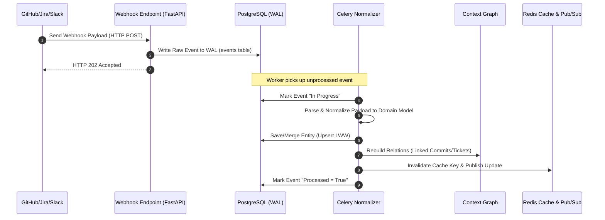
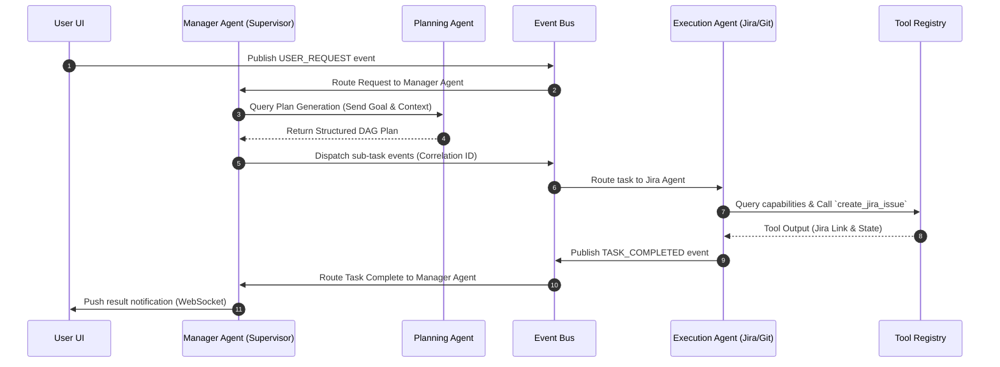

# Detailed Component Architecture: AI-Powered Technical Project Manager (AI-TPM)

This document provides exhaustive, production-grade architectural specifications for each of the fourteen (14) core modules of the AI-Powered Technical Project Manager. It is designed to serve as an implementation blueprint for software engineers to build components independently while maintaining system consistency.

---

## 1. Context Engine

The Context Engine maintains a real-time, stateful, and normalized representation of the software organization.

```
       [External Webhooks]              [Celery Pollers]
               │                                │
               ▼                                ▼
       ┌───────────────┐                ┌───────────────┐
       │Webhook Ingest │                │Delta Fetchers │
       └───────┬───────┘                └───────┬───────┘
               │                                │
               └───────────────┬────────────────┘
                               ▼
                    ┌─────────────────────┐
                    │  Write-Ahead Log    │
                    │ (PostgreSQL Events) │
                    └──────────┬──────────┘
                               │ Asynchronous Processing
                               ▼
                    ┌─────────────────────┐
                    │ Normalization Stage │
                    └──────────┬──────────┘
                              ▼
                    ┌─────────────────────┐
                    │ Merge & Conflict    │
                    │  Resolution (LWW)   │
                    └──────────┬──────────┘
                               ▼
                    ┌─────────────────────┐
                    │ Context Graph & DB  │
                    │   (PostgreSQL)      │
                    └──────────┬──────────┘
                               ▼
                    ┌─────────────────────┐
                    │ Cache Invalidation  │
                    │   (Redis Pub/Sub)   │
                    └─────────────────────┘
```

### Responsibilities
* **Ingestion**: Raw data capture from webhooks and periodic API polling.
* **Normalization**: Parsing platform-specific structures (GitHub PRs, Jira Issues, Slack Messages, Calendar Events) into standardized Domain Models.
* **State Aggregation**: Building and updating a unified graph representation of relationships between developers, commits, tickets, messages, and meetings.
* **Sync Management**: Tracking data latency, sync bounds, and schema version changes.

### Internal Architecture
* **Ingestion Pipeline**: Asynchronous workers processing webhook payloads stored in a Write-Ahead Log (WAL) table.
* **Normalization Engine**: Platform-specific parsers mapping raw API payloads to Pydantic objects.
* **Merge & Conflict Engine**: Resolves state issues when messages arrive out of order.
* **Context Graph Engine**: Generates relationships between nodes using recursive SQL queries (`WITH RECURSIVE`).

### Synchronization Strategy
* **Webhooks (Real-Time)**: Fast-path delivery. Handles GitHub event webhooks (PRs, reviews, commits), Jira webhook listeners (issue transitions, edits), and Slack event APIs.
* **Polling (Fallback/Batch Sync)**: Celery jobs scheduled via Celery Beat querying external endpoints for modifications since the last successful sync timestamp (`modified_after`).
* **Sync Frequency Matrix**:
  * GitHub: Webhook-driven (Real-time); backup cron runs daily.
  * Jira: Webhook-driven (Real-time); backup cron runs every 4 hours.
  * Slack: Webhook-driven (Real-time); no polling.
  * Calendar: Polling-driven (Every 15 minutes).

### Context Merging & Conflict Resolution
* **LWW (Last-Write-Wins)**: Uses the API provider’s internal metadata timestamp (`external_updated_at`) rather than the database ingestion timestamp.
* **Source-Priority Matrix**:
  * Jira: Source of truth for Task Status, Priority, Sprint Assignments.
  * GitHub: Source of truth for Git commits, Pull Request approvals, Branch states.
  * Slack/Calendar: Source of truth for communication metadata and schedules.
* *Conflict Resolution Flow*: If a webhook reports a Jira ticket status as `In Progress` at `12:00:00`, but a poll returns the status as `To Do` with a modification timestamp of `11:59:50`, the webhook's `In Progress` status is preserved.

### Incremental Updates & Cache Invalidation
* Cache keys are structured as `org:{org_id}:project:{project_id}:context:{entity_urn}`.
* Normalizer updates update the DB and publish invalidation messages on Redis Pub/Sub.
* WebSockets-connected clients subscribe to these channels to receive state updates.

### Entity Normalization & Context Graph
* Normalizes IDs into Unified Resource Names (URNs), e.g., `urn:org:123:github:pr:456`.
* Graph links are stored in an association table mapping `source_urn` to `target_urn` with a `relation_type`.

### Sequence Diagram: Ingestion and Normalization Flow



---

## 2. Event Bus

The Event Bus decouples services using the Transactional Outbox pattern to ensure reliable delivery.

```
 [Application Service] ──(DB Transaction)──> [Outbox Table (PostgreSQL)]
                                                       │
                                                       ▼ (CDC/WAL Listener)
                                             [Transaction Publisher]
                                                       │
                                                       ▼
                                            [Message Broker (Redis)]
                                                       │
                                ┌──────────────────────┼──────────────────────┐
                                ▼                      ▼                      ▼
                        ┌──────────────┐       ┌──────────────┐       ┌──────────────┐
                        │Agent Consumer│       │Workfl. Engine│       │ WS Broadcast │
                        └──────────────┘       └──────────────┘       └──────────────┘
```

### Event Types & Routing Keys
Routing keys follow a hierarchical format: `<org_id>.<project_id>.<system_module>.<entity_type>.<action>`
* `org123.proj456.github.pr.merged`
* `org123.proj456.agent.manager.task_delegated`
* `org123.proj456.workflow.approval.requested`

### Event Schemas & Versioning
Every event conforms to a standardized metadata envelope:

```json
{
  "event_id": "uuid-v4",
  "correlation_id": "uuid-v4",
  "routing_key": "org123.proj456.github.pr.merged",
  "schema_version": "1.2.0",
  "timestamp": "2026-07-17T11:00:00Z",
  "tenant_id": "uuid-v4",
  "payload": {
    "pr_number": 42,
    "repository": "backend-repo",
    "merged_by": "urn:user:github:123"
  }
}
```

* **Versioning Policy**: SemVer is applied to event schemas. Incompatible schema modifications increment the major version. Consumers declare version compatibility matrices; adapters translate legacy payloads to maintain compatibility.

### Retry Mechanisms & Dead Letter Queue (DLQ)
* **Exponential Backoff**: If a consumer fails to process a message, it retries after `2^attempt * 5` seconds (with random jitter).
* **DLQ Routing**: After 5 failed attempts, the event is wrapped in a DLQ metadata envelope and routed to the `dlq.queue` for manual inspection and alerting.

### Idempotency & Message Delivery
* **Idempotency Key**: Every consumer maintains an execution cache in Redis using the `event_id` as the key. If an ID is present in the cache, the processing step is skipped.
* **Ordering Guarantees**: Queue partitions are keyed by `project_id`. Events within a single project are processed sequentially.
* **Event Sourcing**: System events are persisted in the PostgreSQL event log table, enabling developers to replay events by setting a consumer to a specific historical event log timestamp.

---

## 3. Agent Orchestration Layer

The Agent Orchestration Layer runs stateless agents that communicate via structured messages.



### Agent Roles & Workload Division
* **Manager Agent**: Standardizes orchestrations. Allocates tasks to sub-agents based on capability listings.
* **Planning Agent**: Evaluates project constraints and computes critical path schedules.
* **GitHub, Jira, Slack, Calendar Agents**: Specialized execution agents that interact with external APIs through tools.
* **Analytics Agent**: Processes historical logs to identify blockers and calculate trends.
* **Workflow Agent**: Translates DAG configurations into task events.

### Agent Lifecycle
```
[Registered] ──> [Idle] ──> [Executing] ──> [Suspended (Waiting for Tool/Human)]
                            │               │
                            ▼               ▼
                       [Completed]      [Timed Out/Failed]
```

### Coordination, Capabilities & Failure Recovery
* **Capability Registry**: Agents register capabilities in Redis using a bitmap representation (e.g., `github:pr:write`).
* **Delegation Pattern**: Agents delegate tasks by publishing target task events to the Event Bus with matching `correlation_id` values.
* **Failure Recovery**: Agents publish heartbeat events to Redis every 5 seconds. If a heartbeat is missed for 30 seconds, the Manager Agent invalidates the run state and resubmits the task event.

---

## 4. Memory System

Memory is partitioned into five distinct layers to balance performance and storage costs:

| Memory Layer | Storage Engine | Key Structure / Data Types | Expiration & Retention |
| :--- | :--- | :--- | :--- |
| **Short-term** | Redis | Hashes (`agent:run:{run_id}:scratchpad`) | Expires 30 mins after run completes. |
| **Conversation** | pgvector + Postgres | Tables: `chat_history`, `chat_embeddings` | Indefinite retention. |
| **Project** | pgvector + Postgres | Table: `project_memories` (embeddings) | Indefinite retention. |
| **Organization** | PostgreSQL | Tables: `org_rules`, `integration_tokens` | Configurable; manual updates. |
| **Long-term** | PostgreSQL | Table: `agent_execution_logs` | Rotated to cold storage after 1 year. |

### Memory Retrieval Mechanics
1. **Semantic Search**: Text queries are converted into embeddings using an OpenAI text-embedding model. A cosine-distance query is run on the pgvector index:
   ```sql
   SELECT content, metadata FROM agent_memories
   WHERE organization_id = :org_id AND project_id = :proj_id
   ORDER BY embedding <=> :query_embedding LIMIT 5;
   ```
2. **Key-Value Match**: Exact keys (such as active configuration options or cached user states) are retrieved directly from Redis.
3. **Graph Traversal**: Recursive queries trace related entities through foreign keys in the context database.

### Memory Summarization Loop
To prevent context window saturation, conversation logs are summarized when they exceed a token threshold.

```
[Raw Chat Log (9,000 Tokens)] ──> [Summarizer Worker (LLM)]
                                             │
                                             ├─► Write summary bullet points
                                             ├─► Generate Semantic Embeddings
                                             │
                                             ▼
                                [Update Vector Index]
                                [Truncate raw log to last 2,000 tokens]
```

---

## 5. Tool Calling Framework

The Tool Calling Framework enables agents to interact securely with external services.

```
 [Agent Engine] ──(Request Tool Call)──► [Tool Registry]
                                               │
                                               ▼ (Validate Args Schema)
                                     [OAuth Token Manager]
                                               │
                                               ▼ (Inject Creds)
                                      [Permission Guard]
                                               │
                        ┌──────────────────────┴──────────────────────┐
                        ▼ Requires Approval                           ▼ Auto-Execute
             [Approval Pipeline (Slack)]                    [Sandbox Executor]
```

### Tool Registry, Discovery & Authentication
* **Decorator Registration**: Python functions are registered as tools using a `@tool` decorator. Pydantic models are used to validate argument schemas.
* **Tool Metadata Payload**: Dynamic tool metadata is generated in JSON Schema format and injected into the LLM context.
* **OAuth Proxy**: The framework handles token retrieval, decryption, validity checks, and renewal. Decrypted OAuth tokens are injected into outbound headers at runtime.

### Security, Sandboxing & Approvals
* **Sandboxing**: Code execution tasks run within ephemeral Docker containers. API requests are routed through a proxy that restricts traffic to authorized endpoints.
* **RBAC checks**: Tool definitions specify required roles: `@tool(roles=['Admin', 'ProjectManager'])`.
* **Approval Pipeline**: Mutating tools (e.g., `merge_pull_request`) pause execution and publish an approval event. The system listens for a webhook response to resume processing.

---

## 6. Workflow Engine

The Workflow Engine coordinates execution tasks defined as Directed Acyclic Graphs (DAGs).

```
         ┌──────────────┐
         │ Trigger Node │
         └──────┬───────┘
                ▼
         ┌──────────────┐
         │ Task Node 1  │
         └──────┬───────┘
                ▼
       ┌───────────────────┐
      /                     \
     ▼                       ▼
 ┌──────────────┐        ┌──────────────┐
 │ Task Node 2A │        │ Task Node 2B │
 └──────┬───────┘        └──────┬───────┘
        \                      /
         ▼                    ▼
       ┌───────────────────┐
      /                     \
     ▼ Conditional           ▼
 ┌──────────────┐        ┌──────────────┐
 │Approval Node │        │  Skip Step   │
 └──────┬───────┘        └──────────────┘
        ▼
  ┌───────────┐
  │Rollback/  │
  │Compensate │
  └───────────┘
```

### Workflow Execution Mechanics
* **Storage**: DAG definitions and execution states are stored in PostgreSQL (`workflows` and `workflow_executions`).
* **Execution State Machine**:
  * **Parallel Execution**: Independent branches of the DAG are dispatched as parallel Celery tasks.
  * **Conditional Branches**: The engine evaluates expression results from parent nodes to select downstream paths.
  * **Suspended State**: Approval nodes set the execution status to `suspended`. The execution context is serialized to the database while waiting for a resumption signal.
  * **Rollback via Sagas**: If a step fails, the engine runs registered compensating actions in reverse order to clean up partial changes.

---

## 7. Recommendation Engine

The Recommendation Engine analyzes project data to identify risks and suggest optimizations.

```
       [Context Snapshots]                [Analytics Tables]
                │                                 │
                └────────────────┬────────────────┘
                                 ▼
                     ┌──────────────────────┐
                     │ Risk Scoring Pipeline│
                     └───────────┬──────────┘
                                 ▼
                     ┌──────────────────────┐
                     │  Deduplication &     │
                     │  Relevance Filters   │
                     └───────────┬──────────┘
                                 ▼
                     ┌──────────────────────┐
                     │  Recommendation Log  │
                     │     (PostgreSQL)     │
                     └──────────────────────┘
```

### Key Scenarios
1. **Developer Overload**: Identifies when a developer is assigned high-priority story points that exceed their average sprint velocity by 30%.
2. **Sprint Delay Prediction**: Simulates sprint completion timelines using Monte Carlo simulations.
3. **PR Bottlenecks**: Flags PRs that have been open for over 48 hours or have more than 15 unresolved comments.

### Scoring & Confidence Calculations
Recommendations are assigned a priority score based on impact and likelihood:
$$\text{Score} = (\text{Impact} \times 0.6) + (\text{Urgency} \times 0.4)$$
Confidence scores are calculated based on data quality:
$$\text{Confidence} = \frac{\text{Historical Data Points}}{\text{Required Data Points}} \times (1.0 - \text{Noise Coefficient})$$

* **Lifecycle**: `DRAFT` -> `PUBLISHED` -> `DISMISSED` or `ACCEPTED` (triggering a workflow).

---

## 8. Analytics Engine

The Analytics Engine processes raw event logs to calculate operational metrics.

```
       [Raw Event Log] ────► [Celery Aggregators] ────► [Time-Series DB]
                                                                │
                                                                ▼
                                                       [Dashboard API]
```

### Metrics Calculation Reference
* **Sprint Velocity**:
  $$\text{Velocity} = \sum (\text{Story Points of Completed Issues in Sprint})$$
* **Lead Time**:
  $$\text{Lead Time} = t_{\text{deployed}} - t_{\text{created}}$$
* **Cycle Time**:
  $$\text{Cycle Time} = t_{\text{deployed}} - t_{\text{started}}$$
* **Developer Load**:
  $$\text{Load} = \sum_{i \in \text{Issues}} \text{PriorityWeight}_i \times \text{StoryPoints}_i$$

* **Refresh Strategy**: Time-series calculations are run hourly. Telemetry updates are published immediately to WebSocket channels.

---

## 9. Notification Engine

The Notification Engine delivers notifications to users across multiple channels.

```
 [Application Service] ──► [Notification Broker] ──► [User Prefs Resolver]
                                                            │
                                  ┌─────────────────────────┼─────────────────────────┐
                                  ▼                         ▼                         ▼
                           [Slack Gateway]           [Email Gateway]          [Push Gateway]
```

### Routing & Delivery Rules
* **Delivery Routing**: The user preferences table maps notification types (e.g., `PR_REQUEST`, `SYSTEM_ALERT`) to channels (Slack, email, push, dashboard).
* **Batch Digesting**: Low-priority notifications are queued and summarized into daily digests. High-priority items (such as blocker alerts) bypass the queue for immediate delivery.
* **Retry Protocol**: Delivery attempts use exponential backoff. If a channel fails, the engine escalates the notification to alternative channels.

---

## 10. Knowledge Graph

The Knowledge Graph tracks relationships between project entities.

```
             ┌───────────┐
             │ Developer │
             └─────┬─────┘
                   │ assigned_to
                   ▼
  ┌─────┐    ┌───────────┐    ┌────┐
  │ PR  ├───►│   Issue   │◄───┤File│
  └─────┘    └───────────┘    └────┘
  merged_in    blocked_by     modified_by
```

### Nodes & Relationships
* **Node Types**: `Developer`, `Project`, `Repository`, `Issue`, `PR`, `Meeting`, `Message`, `File`.
* **Relationship Types**: `assigned_to`, `blocked_by`, `merged_in`, `mentioned_in`, `reviews`, `depends_on`, `modified_by`.

### Relational Graph Queries
To resolve questions such as: *"Find the developers affected by the commit that blocked issue PROJ-123"*
```sql
WITH RECURSIVE dependency_chain AS (
    -- Anchor member: find the blocking issue
    SELECT target_urn, source_urn, relation_type
    FROM context_relations
    WHERE target_urn = 'urn:jira:issue:PROJ-123' AND relation_type = 'blocked_by'
    
    UNION
    
    -- Recursive member: traverse dependencies
    SELECT r.target_urn, r.source_urn, r.relation_type
    FROM context_relations r
    INNER JOIN dependency_chain dc ON r.target_urn = dc.source_urn
)
SELECT DISTINCT u.email 
FROM dependency_chain dc
INNER JOIN users u ON dc.source_urn = u.urn
WHERE dc.relation_type = 'assigned_to';
```

---

## 11. Real-Time Dashboard Pipeline

The real-time dashboard pipeline broadcasts updates over WebSockets using Redis Pub/Sub.

```
 [Clients UI] ◄──(WebSockets)──► [FastAPI WS Servers] ◄──(Pub/Sub)──► [Redis Channels]
                                                                          ▲
                                                                          │ Publish
                                                                   [Event Processor]
```

* **Subscriptions**: Clients connect to `ws://api.domain/v1/ws` and subscribe to specific channels (e.g., `{"action": "subscribe", "channel": "project:123:tasks"}`).
* **Broadcasting**: The WebSocket connection manager tracks active client subscriptions. When an event is received from Redis, it is filtered and sent to the matching client connections.

---

## 12. Security Architecture

The security model implements tenant isolation, access controls, and encryption.

```
  [HTTPS Requests] ──► [WAF & Rate Limiter] ──► [Tenant Context Middleware]
                                                          │
                                                          ▼ (Verify JWT)
                                                 [RBAC Authorization]
                                                          │
                                                          ▼
                                              [Access Encrypted DB]
```

### Security Controls
* **Tenant Isolation**: Row-Level Security (RLS) is enabled on all tables using `organization_id`.
* **Credentials Encryption**: OAuth tokens and secrets are encrypted before database insertion using AES-256-GCM. Decryption keys are managed using a secrets manager.
* **Audit Logging**: Write operations trigger inserts into an immutable audit table in PostgreSQL.
* **API Rate Limiting**: Redis-based token bucket rate limiting is applied per API key and tenant.

---

## 13. Scalability

```
                       [Load Balancer]
                              │
         ┌────────────────────┼────────────────────┐
         ▼                                         ▼
 ┌─────────────────┐                       ┌─────────────────┐
 │FastAPI Web Node1│                       │FastAPI Web Node2│
 └────────┬────────┘                       └────────┬────────┘
          │                                         │
          └────────┬───────────────────────┬────────┘
                   ▼                       ▼
             ┌───────────┐           ┌───────────┐
             │Redis PubS │           │Celery Qu. │
             └─────┬─────┘           └─────┬─────┘
                   │                       │
                   ▼                       ▼
          ┌─────────────────┐     ┌─────────────────┐
          │ Celery Worker1  │     │ Celery Worker2  │
          └─────────────────┘     └─────────────────┘
```

### Scale Targets & Strategy
* **FastAPI Servers**: Stateless application instances scale horizontally behind a load balancer.
* **WebSocket Servers**: Handled by separate ASGI execution pools. Connections are coordinated using a shared Redis Pub/Sub backplane.
* **Celery Workers**: Tasks are routed to specialized worker pools:
  * `io-heavy` pool: Runs network-bound integration sync tasks.
  * `agent-heavy` pool: Runs CPU-bound agent reasoning and planning tasks.
* **Database Scaling**: Read replicas handle analytics and reporting queries, while the master node handles write traffic. Redis is deployed in a cluster configuration to support distributed caching.

---

## 14. Observability

The system uses standard observability tools to track system health and costs.

```
 [App Nodes / Workers] ──► [OpenTelemetry SDK] ──► [Prometheus / Grafana]
                                              ──► [Jaeger / Zipkin]
                                              ──► [Vector / Elasticsearch]
```

### Observability Metrics
* **Tracing**: OpenTelemetry context propagation is used to trace requests across web nodes, Celery workers, and agent tasks.
* **System Logging**: Structured JSON logs are captured and exported to a centralized logging pipeline.
* **LLM Cost Tracking**: API responses are parsed to log token consumption and costs:
  ```json
  {
    "timestamp": "2026-07-17T11:20:00Z",
    "agent_name": "planning_agent",
    "model": "gpt-4o",
    "prompt_tokens": 4500,
    "completion_tokens": 850,
    "cost_usd": 0.0490
  }
  ```
* **Tool Monitoring**: Execution times, error rates, and arguments are tracked for all tool calls to identify performance bottlenecks.

---

## 15. Architectural Decision Records (ADRs)

### ADR 004: DAG Workflow Engine vs. Autonomous LangChain/Agent Executor
* **Context**: Autonomous agents can struggle to follow complex business processes, occasionally getting stuck in infinite loops or taking unauthorized actions.
* **Decision**: Core project management operations are governed by a **structured DAG Workflow Engine**. Agents are used to complete specific tasks within DAG nodes rather than orchestrating the entire process.
* **Consequence**: Provides predictable execution paths, reliable error handling, and auditability, while allowing agents to execute isolated tasks within designated boundaries.

### ADR 005: Relational Context Graphs with Recursion vs. Graph Database (Neo4j)
* **Context**: Maintaining Neo4j alongside PostgreSQL adds operational overhead and complexity to data synchronization.
* **Decision**: Keep the primary data store in **PostgreSQL** and model relationships using adjacency lists. Adjacency lists are traversed using recursive Common Table Expressions (CTEs).
* **Consequence**: Simplifies the database stack, maintains transactional consistency, and supports recursive queries for small to medium graphs.

### ADR 006: Redis Streams vs. RabbitMQ for the Event Bus
* **Context**: The Event Bus requires message persistence, consumer grouping, and support for real-time WebSockets.
* **Decision**: Use **Redis Streams** as the messaging backplane.
* **Consequence**: Leverages existing Redis instances, simplifies the deployment stack, and provides fast message delivery, consumer groups, and replay capabilities.
