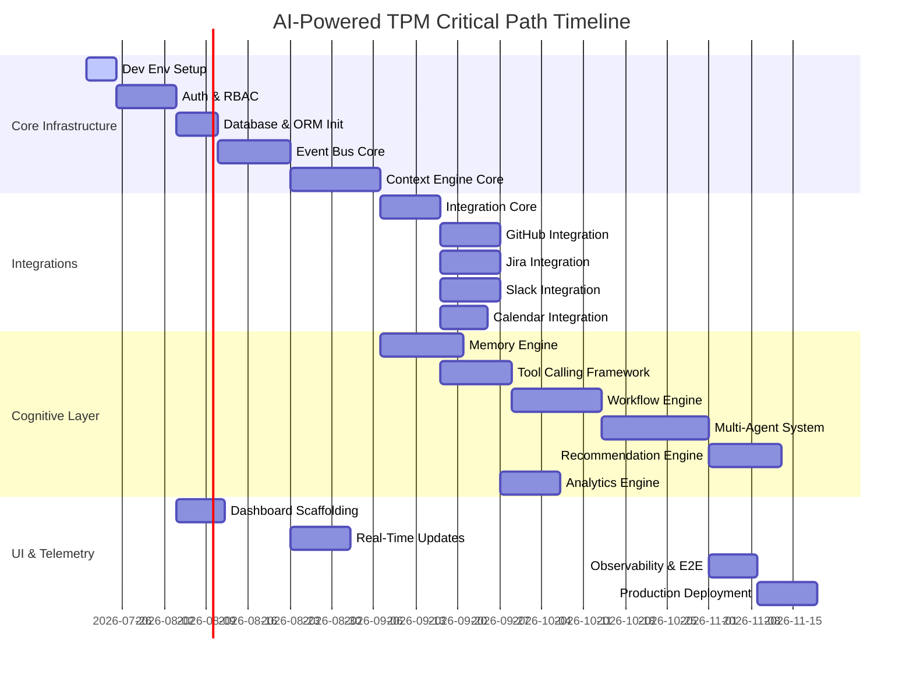

# Implementation Roadmap: AI-Powered Technical Project Manager (AI-TPM)

This document provides a production-grade, milestone-based implementation roadmap. It outlines the sequence of construction, deliverables, testing plans, risks, timeline, and sprint divisions required to build the AI-TPM.

---

## 1. Milestone Specifications

### Milestone 1: Development Environment Setup
* **Objective**: Configure local development environment, multi-container orchestrations, monorepo paths, CI/CD scaffolding, and basic code standard verification configs.
* **Complexity / Effort**: Low / 5 days.
* **Dependencies**: None.
* **Expected Deliverables**: Initial monorepo layout, Docker Compose file, linting configurations (Ruff, ESLint), pre-commit hooks, and GitHub Actions CI template.
* **Backend Tasks**: Initialize FastAPI skeleton structure, setup poetry/pip dependencies, configure basic healthcheck routes.
* **Frontend Tasks**: Scaffold Next.js 15 template with TypeScript, Lucide Icons, configure Tailwind CSS.
* **Database Changes**: Database container instantiation in Docker (PostgreSQL 16 + Redis 7).
* **API Endpoints**: `GET /health` (System status verification).
* **Background Jobs**: Local Celery container running alongside app.
* **WebSocket Events**: None.
* **Tests**: Basic container connectivity checks, integration test pipeline skeleton.
* **Risks**: Local network proxy blockages, local Docker volume permission conflicts on Windows environments.
* **Testing Strategy**: Automation of dependency installations and container boot checks in CI.
* **Definition of Done**: Multi-container compose system spins up with a single command, CLI linter checks pass, and health check API returns `200 OK`.

---

### Milestone 2: Multi-Tenant Authentication & Authorization
* **Objective**: Standardize Tenant authentication with JWT tokens, security rules, and user-to-organization mappings.
* **Complexity / Effort**: Medium / 10 days.
* **Dependencies**: Milestone 1.
* **Expected Deliverables**: Multi-tenant user registries, JWT authorization middleware, RBAC checks, encrypted authentication routes.
* **Backend Tasks**: Implement JWT generator/verifier, Password hashing helper, FastAPI Auth Dependencies, RBAC middleware logic.
* **Frontend Tasks**: Create login pages, setup cookies storage, Axios interceptors to attach Authorization headers.
* **Database Changes**: Create tables: `organizations`, `users`, `roles`, `permissions`, `user_roles`, `role_permissions`.
* **API Endpoints**: `POST /api/v1/auth/login`, `POST /api/v1/auth/register`, `GET /api/v1/auth/me`.
* **Background Jobs**: None.
* **WebSocket Events**: Client connection validation check against Authorization JWT.
* **Tests**: Test token generation, token expiration behavior, endpoint access without tokens, and role authorization checks.
* **Risks**: Token leakage, session synchronization inconsistencies between local caches and Postgres.
* **Testing Strategy**: End-to-end integration tests using pytest-asyncio to verify unauthorized endpoint accesses.
* **Definition of Done**: Secure routes restrict requests without valid JWT, roles successfully block unauthorized actions, and credentials are encrypted.

---

### Milestone 3: Database & ORM Layer Initialization
* **Objective**: Scaffold database models, initialize Alembic, establish connection pooling, configure row-level tenant security scopes, and setup pgvector vector tables.
* **Complexity / Effort**: Medium / 7 days.
* **Dependencies**: Milestone 2.
* **Expected Deliverables**: Alembic config, initial database migration scripts, base model definitions.
* **Backend Tasks**: Implement SQLAlchemy declarative models, DB engine connection pool configurations (PgBouncer compatibility), dynamic tenant resolution session filters.
* **Frontend Tasks**: None.
* **Database Changes**: Complete initial Alembic migration schema generation. Create `vector` extension.
* **API Endpoints**: None.
* **Background Jobs**: Database connection monitoring crons.
* **WebSocket Events**: None.
* **Tests**: Database migrations rollback/rollforward tests, concurrent database connection load testing.
* **Risks**: Connection leaks during high-load WebSocket queries, schema generation mismatch with model definitions.
* **Testing Strategy**: Spin up fresh Postgres instances inside test runners, apply migrations, verify model operations, drop tables.
* **Definition of Done**: Complete migration tree compiles without error, pgvector models are mapped correctly, and database connection checks run without leaks.

---

### Milestone 4: Event Bus Implementation
* **Objective**: Construct Event Bus architecture using the Transactional Outbox pattern, Redis Streams, and Dead Letter Queue (DLQ) support.
* **Complexity / Effort**: High / 12 days.
* **Dependencies**: Milestone 3.
* **Expected Deliverables**: Outbox scheduler, message broker connectors, retry pipeline components, DLQ event viewer endpoints.
* **Backend Tasks**: Implement event payload serializations, Outbox polling workers, Redis Streams client, retry logic, DLQ routing handler.
* **Frontend Tasks**: None.
* **Database Changes**: Create table: `events` (Outbox/Inbox Event log table).
* **API Endpoints**: `GET /api/v1/events/dlq` (Admin view), `POST /api/v1/events/replay`.
* **Background Jobs**: Periodic Celery job checking for unprocessed outbox events and writing them to the broker.
* **WebSocket Events**: Broadcast event payloads to local API server websockets.
* **Tests**: Mock broker failures, verify retry behavior, verify DLQ routing after 5 failures, verify message idempotency.
* **Risks**: Outbox processing latency under massive payload surges, message duplicates.
* **Testing Strategy**: Stress test event processing by pushing 10,000 mock events to verify outbox throughput.
* **Definition of Done**: Messages are committed atomically with DB alterations, consumers process messages idempotently, and failed tasks route to DLQ.

---

### Milestone 5: Context Engine Core
* **Objective**: Build the Context Engine foundation to aggregate and resolve incoming events, normalize raw data payloads, and update cache invalidation keys.
* **Complexity / Effort**: High / 15 days.
* **Dependencies**: Milestone 4.
* **Expected Deliverables**: Normalization schemas, conflict resolution helpers, Redis cache invalidation publishers.
* **Backend Tasks**: Build normalization adapters, conflict resolution LWW rules, cache invalidation listeners.
* **Frontend Tasks**: Setup dynamic data tables displaying active project context parameters.
* **Database Changes**: Create table: `context_snapshots`.
* **API Endpoints**: `GET /api/v1/context/projects/{id}/state`.
* **Background Jobs**: Celery task parsing outbox entries, translating to unified models, and merging states.
* **WebSocket Events**: Send real-time context update events on change.
* **Tests**: Test conflict resolution rules, test schema validation errors, check cache invalidation triggers.
* **Risks**: Performance bottlenecks during complex nested JSON merges.
* **Testing Strategy**: Feed simulated out-of-order webhook events and verify target state output equals the latest timestamp payload.
* **Definition of Done**: Project states are compiled correctly, cached entries update on DB writes, and WebSocket updates broadcast changes.

---

### Milestone 6: Integration Core Framework
* **Objective**: Establish the unified OAuth callback handler, encrypted credential manager, and rate limiters for external third-party integrations.
* **Complexity / Effort**: Medium / 10 days.
* **Dependencies**: Milestone 5.
* **Expected Deliverables**: Redirect handlers, encryption wrapper scripts, API rate limit handlers.
* **Backend Tasks**: Implement encryption/decryption helpers (cryptography Fernet), OAuth authorization endpoints, tenant token retrieval middleware.
* **Frontend Tasks**: Create Connection Center UI displaying available integrations and connect/disconnect buttons.
* **Database Changes**: Create tables: `integrations`, `oauth_tokens`.
* **API Endpoints**: `GET /api/v1/integrations/connect/{provider}`, `GET /api/v1/integrations/callback/{provider}`, `DELETE /api/v1/integrations/{id}`.
* **Background Jobs**: Token expiration checker cron (refreshes expired access tokens in the background).
* **WebSocket Events**: Broadcast status updates when integrations are connected.
* **Tests**: Token decryption validation, OAuth redirect URI parsing verification, API token refresh loops.
* **Risks**: Security leaks of decryption keys, provider rate limit blocking during testing.
* **Testing Strategy**: Mock external provider token responses and verify state updates and database encryption.
* **Definition of Done**: Integration table records tokens in AES-256-GCM encrypted format, expired tokens refresh in background, and connection dashboard updates in real-time.

---

### Milestone 7: GitHub Integration
* **Objective**: Build GitHub webhook handler, repositories sync, PR parsing, and branch detail tracking.
* **Complexity / Effort**: Medium / 10 days.
* **Dependencies**: Milestone 6.
* **Expected Deliverables**: Webhook handler, repo syncer, PR state models.
* **Backend Tasks**: Implement webhook payload signatures validator, GitHub API client endpoints, sync schedules.
* **Frontend Tasks**: Show repo links, PR cards list, sync telemetry.
* **Database Changes**: Create table: `repositories`.
* **API Endpoints**: `POST /api/v1/integrations/webhooks/github`, `POST /api/v1/integrations/github/sync`.
* **Background Jobs**: Delta sync worker for repositories.
* **WebSocket Events**: PR event broadcasts.
* **Tests**: Webhook payload verification checks, delta fetching validation.
* **Risks**: GitHub API changes, rate limit exhausts.
* **Testing Strategy**: Mock GitHub webhook payload injections and assert database values.
* **Definition of Done**: Webhooks process GitHub updates, and repository metadata maps correctly to normalized schemas.

---

### Milestone 8: Jira Integration
* **Objective**: Implement Jira Webhook listener, ticket parsing, sprint timelines extraction, and metadata synchronization.
* **Complexity / Effort**: Medium / 10 days.
* **Dependencies**: Milestone 6.
* **Expected Deliverables**: Jira API client, ticket synchronization pipelines.
* **Backend Tasks**: Build webhook routes, Jira client, ticket models.
* **Frontend Tasks**: Ticket view dashboard, sprint cards layout.
* **Database Changes**: Add Jira attributes to project configuration templates.
* **API Endpoints**: `POST /api/v1/integrations/webhooks/jira`, `POST /api/v1/integrations/jira/sync`.
* **Background Jobs**: Celery task retrieving sprint ticket scopes.
* **WebSocket Events**: Ticket status modification events.
* **Tests**: Mock Jira payloads, ticket state validation, mapping validation.
* **Risks**: Large ticket lists causing memory issues.
* **Testing Strategy**: Test parsing of nested Jira objects (custom fields, epic links).
* **Definition of Done**: Webhooks process status changes, and tickets map to normalized schemas.

---

### Milestone 9: Slack Integration
* **Objective**: Setup Slack App credentials integration, event listeners, channel indexing, message normalizers, and interactive app blocks.
* **Complexity / Effort**: Medium / 10 days.
* **Dependencies**: Milestone 6.
* **Expected Deliverables**: Slack webhook gateway, message parsing scripts.
* **Backend Tasks**: Event API validation handler, message normalizer, interactive block action handlers.
* **Frontend Tasks**: Display relevant Slack channel connection cards.
* **Database Changes**: Slack channel-to-project mappings layout.
* **API Endpoints**: `POST /api/v1/integrations/webhooks/slack/events`, `POST /api/v1/integrations/webhooks/slack/actions`.
* **Background Jobs**: None.
* **WebSocket Events**: Real-time message streaming.
* **Tests**: Slack payload challenge verification, message normalizations.
* **Risks**: Message spam, high load from busy channels.
* **Testing Strategy**: Verify message delivery from channels to project indexes using simulated Slack payloads.
* **Definition of Done**: Webhook validates signature challenges, messages map to unified model formats.

---

### Milestone 10: Google Calendar Integration
* **Objective**: Configure calendar polling delta synchronizers, agenda indexing, and attendee lists parsing.
* **Complexity / Effort**: Low / 8 days.
* **Dependencies**: Milestone 6.
* **Expected Deliverables**: Calendar sync scheduler, meeting parser.
* **Backend Tasks**: Google Calendar API adapter, delta sync parser.
* **Frontend Tasks**: Meeting dashboard view, scheduling interfaces.
* **Database Changes**: Create table: `meetings`.
* **API Endpoints**: `POST /api/v1/integrations/calendar/sync`.
* **Background Jobs**: Poller running every 15 minutes fetching updated meetings.
* **WebSocket Events**: Updates to dashboard meetings.
* **Tests**: Sync tokens updates, meeting attendee lists mapping checks.
* **Risks**: Timezone parsing issues.
* **Testing Strategy**: Mock API payloads across timezones and verify database inputs.
* **Definition of Done**: Calendar events sync automatically, and attendee states map correctly.

---

### Milestone 11: Memory Engine
* **Objective**: Deploy vector search systems using pgvector, short-term Redis cache storage, and summarization pipelines.
* **Complexity / Effort**: High / 14 days.
* **Dependencies**: Milestone 3.
* **Expected Deliverables**: Vector DB connection pool, similarity search APIs, periodic summarizers.
* **Backend Tasks**: Implement pgvector search queries, text embedding generator (OpenAI client wrapper), log summarization scripts.
* **Frontend Tasks**: None.
* **Database Changes**: Create table: `agent_memories`.
* **API Endpoints**: `GET /api/v1/memory/search`.
* **Background Jobs**: Periodic summarization loops for conversation logs.
* **WebSocket Events**: None.
* **Tests**: Vector insert speed tests, recall quality checks, context window limit checks.
* **Risks**: High LLM cost during indexing, vector indexing latencies.
* **Testing Strategy**: Run tests with mock embeddings to verify vector similarity queries.
* **Definition of Done**: HNSW index is created, memory search returns relevant results, and summaries trigger when logs exceed token limits.

---

### Milestone 12: Tool Calling Framework
* **Objective**: Create the decorator-based Tool Registry, authorization injection middleware, and execution sandbox structures.
* **Complexity / Effort**: High / 12 days.
* **Dependencies**: Milestone 6.
* **Expected Deliverables**: Tool decorator framework, registry JSON schemas, sandbox execution wrapper.
* **Backend Tasks**: Implement tool registry parser, dynamic arg checker, credentials inject handler, isolated docker executor logic.
* **Frontend Tasks**: UI widgets to review and approve pending tool calls.
* **Database Changes**: Create table: `tool_executions`.
* **API Endpoints**: `GET /api/v1/tools/registry`, `POST /api/v1/tools/approve/{id}`.
* **Background Jobs**: Sandbox cleanup worker.
* **WebSocket Events**: Request tool approval alert.
* **Tests**: Verify unauthorized execution blocking, verify parameters validate schema, test execution inside Docker container.
* **Risks**: Arbitrary code execution vulnerability in sandboxes.
* **Testing Strategy**: Attempt to invoke host-level commands via tool executor to verify sandbox boundaries.
* **Definition of Done**: Tools validate inputs, token injection handles credentials, and mutating tools wait for approval.

---

### Milestone 13: Workflow Engine
* **Objective**: Establish the state machine engine to execute DAGs, manage execution states, handle branch evaluations, and support Sagas rollback.
* **Complexity / Effort**: High / 15 days.
* **Dependencies**: Milestone 12.
* **Expected Deliverables**: DAG scheduler engine, Saga rollback handler, transition state stores.
* **Backend Tasks**: Workflow DAG validator, step executor engine, Sagas rollback tracker.
* **Frontend Tasks**: Visual DAG execution tracking board, workflow builder canvas (initial version).
* **Database Changes**: Create tables: `workflows`, `workflow_executions`.
* **API Endpoints**: `POST /api/v1/workflows/start`, `GET /api/v1/workflows/executions/{id}`.
* **Background Jobs**: Celery task runner executing steps in parallel.
* **WebSocket Events**: Step complete broadcasts.
* **Tests**: Branch parsing tests, parallel steps validation, rollback action triggers on step failure.
* **Risks**: Deadlocks on join nodes in parallel DAG runs.
* **Testing Strategy**: Run failing DAG workflows to verify Saga rollback actions execute correctly.
* **Definition of Done**: Complex DAG pipelines run, execution logs persist, and failed states run rollback tasks.

---

### Milestone 14: Multi-Agent System (MAS)
* **Objective**: Coordinate multi-agent logic (Manager, Planning, Execution Agents) over the Event Bus.
* **Complexity / Effort**: High / 18 days.
* **Dependencies**: Milestones 11, 13.
* **Expected Deliverables**: Agent definitions, prompt versions config, execution monitor dashboards.
* **Backend Tasks**: Multi-agent supervisors, task delegates, prompt template loaders.
* **Frontend Tasks**: Agent chat interface, thought log terminal viewer.
* **Database Changes**: Create tables: `agent_executions`, `prompt_versions`, `model_configurations`.
* **API Endpoints**: `POST /api/v1/agents/chat`, `GET /api/v1/agents/executions/{id}`.
* **Background Jobs**: Celery tasks running planning loops.
* **WebSocket Events**: Real-time thought logs stream.
* **Tests**: Prompt validation tests, loop detection, timeout recover.
* **Risks**: Agent loop cost runaway, hallucinated tasks.
* **Testing Strategy**: Run agent tasks under strict rate limits to verify loops terminate after set iterations.
* **Definition of Done**: Agents receive and process requests, use memory engines, invoke tools, and save output.

---

### Milestone 15: Recommendation Engine
* **Objective**: Build risk detection algorithms, predictive velocity calculations, and recommendation scoring loops.
* **Complexity / Effort**: Medium / 12 days.
* **Dependencies**: Milestones 8, 14.
* **Expected Deliverables**: Risk evaluator worker, scoring pipeline.
* **Backend Tasks**: Developer overload analyzer, sprint delay predictor (Monte Carlo), PR bottleneck tracker, meeting optimizer.
* **Frontend Tasks**: Recommendation cards list, alert banners.
* **Database Changes**: Create table: `recommendations`.
* **API Endpoints**: `GET /api/v1/recommendations/active`, `POST /api/v1/recommendations/{id}/action`.
* **Background Jobs**: Recommendation generator cron (runs hourly).
* **WebSocket Events**: Risk alerts broadcast.
* **Tests**: Velocity predictions consistency, alert criteria triggers.
* **Risks**: False alarms, calculation inaccuracies.
* **Testing Strategy**: Verify risk scoring triggers using artificial developer load datasets.
* **Definition of Done**: Recommendations are generated, scores align with priorities, and cards update in real-time.

---

### Milestone 16: Analytics Engine
* **Objective**: Implement sprint velocity calculations, lead/cycle time trackers, developer load metrics, and time-series reports.
* **Complexity / Effort**: Medium / 10 days.
* **Dependencies**: Milestones 7, 8.
* **Expected Deliverables**: Time-series aggregate tables, background metric calculators.
* **Backend Tasks**: Velocity calculation formulas, lead time tracking logic, developer load calculations.
* **Frontend Tasks**: Burn-down charts, PR cycle charts, velocity graphs.
* **Database Changes**: Create table: `analytics_metrics`.
* **API Endpoints**: `GET /api/v1/analytics/project/{id}/summary`.
* **Background Jobs**: Hourly Celery analytics calculator.
* **WebSocket Events**: Real-time dashboard updates.
* **Tests**: Asset metric calculations match source datasets, database load testing.
* **Risks**: Performance issues when querying large event histories.
* **Testing Strategy**: Query analytics pipelines against 100,000 historical commits/tickets to verify latency limits.
* **Definition of Done**: Analytics show sprint progress, charts match data points, and jobs compile data hourly.

---

### Milestone 17: Frontend Dashboard Scaffolding
* **Objective**: Assemble dashboard shell layout, workspace routes, and unified navigation components.
* **Complexity / Effort**: Low / 8 days.
* **Dependencies**: Milestone 1.
* **Expected Deliverables**: Layout frameworks, theme context, client states hooks.
* **Frontend Tasks**: Workspace list shell, responsive menus, notification dropdowns, dark mode theme configuration.
* **API Endpoints**: `GET /api/v1/workspaces/list`.
* **Tests**: Test page navigation routing and theme state persistence.
* **Definition of Done**: Dashboard layout loads, responsiveness matches guidelines, navigation works.

---

### Milestone 18: Real-Time Updates Pipeline
* **Objective**: Integrate WebSocket listeners, subscription channels, and live dashboard updating.
* **Complexity / Effort**: Medium / 10 days.
* **Dependencies**: Milestone 4.
* **Expected Deliverables**: WebSocket connection manager, Redis Pub/Sub backend.
* **Backend Tasks**: WebSocket routers, client registration lists, keep-alive heartbeats, message broadcast filters.
* **Frontend Tasks**: Real-time log feeds, toast alerts, WebSocket client hook.
* **API Endpoints**: `/v1/ws` (WebSocket connection route).
* **WebSocket Events**: Channel subscriptions, dashboard update alerts.
* **Tests**: Auto-reconnect handling, test load behavior with 1,000 concurrent socket connections.
* **Risks**: Connection drops on mobile/unstable networks.
* **Testing Strategy**: Verify WebSocket auto-reconnection behavior during temporary server downtime.
* **Definition of Done**: Sockets authenticate with JWT tokens, dashboard updates without refreshes, and connection restores automatically.

---

### Milestone 19: Observability & End-to-End Testing
* **Objective**: Integrate OpenTelemetry, tracing systems, alert monitors, and end-to-end user tests.
* **Complexity / Effort**: Medium / 8 days.
* **Dependencies**: Milestones 13, 14.
* **Expected Deliverables**: OpenTelemetry configurations, logging pipelines, test runner setups.
* **Backend Tasks**: Log tracing wrappers, Prometheus metric exporters, cost monitoring triggers.
* **Frontend Tasks**: Error boundary views, performance monitors.
* **Database Changes**: Create table: `audit_logs` (if not previously migrated).
* **API Endpoints**: `/metrics` (Prometheus route).
* **Tests**: Comprehensive Playwright end-to-end workflow execution tests.
* **Risks**: Logging overhead under load.
* **Testing Strategy**: Run full end-to-end integration tests to verify the system lifecycle from ingestion to notification.
* **Definition of Done**: End-to-end tests verify core workflows, and system logs export traces correctly.

---

### Milestone 20: Production Deployment Scaffolding
* **Objective**: Configure AWS/GCP infrastructure scripts, Kubernetes deployment manifests, CI/CD deployment pipelines, and database replication configurations.
* **Complexity / Effort**: High / 10 days.
* **Dependencies**: Milestone 19.
* **Expected Deliverables**: Dockerfiles, Kubernetes manifests, Terraform scripts, backup schedules.
* **Backend Tasks**: Production WSGI/ASGI configurations, container health checks.
* **Database Changes**: Configure read replicas and PITR backup configurations.
* **Risks**: Configuration drift across environments, database replication lag.
* **Testing Strategy**: Execute dry-run deployments in a staging environment to verify pipeline configurations.
* **Definition of Done**: Staging environment runs, database replication is active, and backup schedules verify.

---

## 2. Critical Path Diagram



---

## 3. Sprint Planning (2-Week Sprints)

The project will be executed across **10 Sprints** (20 weeks total).

* **Sprint 1 (Weeks 1-2)**:
  * **Milestone 1**: Development Environment Setup.
  * **Milestone 2 (Part 1)**: User registration database schemas, Auth models.
* **Sprint 2 (Weeks 3-4)**:
  * **Milestone 2 (Part 2)**: JWT, Authorization middleware, Login UI.
  * **Milestone 3**: Database & ORM setup, connection pool configuration.
* **Sprint 3 (Weeks 5-6)**:
  * **Milestone 4**: Event Bus, Outbox/Inbox tables, broker configurations.
  * **Milestone 17**: Dashboard layout scaffolding, Navigation shell.
* **Sprint 4 (Weeks 7-8)**:
  * **Milestone 5**: Context Engine Core, normalizations.
  * **Milestone 18**: WebSocket pipeline, live update broadcasts.
* **Sprint 5 (Weeks 9-10)**:
  * **Milestone 6**: Integration Framework, OAuth redirects, encryption.
  * **Milestone 7**: GitHub webhook gateway, repo delta sync.
* **Sprint 6 (Weeks 11-12)**:
  * **Milestone 8**: Jira webhook parsing, Sprint ticket syncing.
  * **Milestone 9**: Slack event listener integration, message normalization.
* **Sprint 7 (Weeks 13-14)**:
  * **Milestone 10**: Google Calendar sync task scheduler.
  * **Milestone 11**: pgvector memory search setup, summaries logic.
* **Sprint 8 (Weeks 15-16)**:
  * **Milestone 12**: Tool Registry, Docker Sandbox runner.
  * **Milestone 13**: Workflow State Machine, DAG validations.
* **Sprint 9 (Weeks 17-18)**:
  * **Milestone 14**: Multi-Agent orchestration, thought log UI.
  * **Milestone 15**: Recommendation risk logic, overload models.
* **Sprint 10 (Weeks 19-20)**:
  * **Milestone 16**: Analytics engine metric computations.
  * **Milestone 19**: Observability dashboards, E2E tests.
  * **Milestone 20**: Terraform setups, Kubernetes manifest releases.

---

## 4. Team Responsibilities Matrix

| Role | Primary Responsibilities | Milestones Lead |
| :--- | :--- | :--- |
| **Backend Engineer** | Core API design, ORM implementation, OAuth, and API routes. | M2, M3, M6, M12 |
| **Integrations Specialist** | Third-party webhooks, message normalizers, and sync schedules. | M7, M8, M9, M10 |
| **System Architect / AI Lead** | Memory engine, Tool registry, Workflow engine, and Agent orchestration. | M4, M5, M11, M13, M14, M15 |
| **Frontend Engineer** | Next.js layout, state hooks, charts, and WebSocket clients. | M17, M18 |
| **DevOps Engineer** | Docker configurations, DB replication, scaling parameters, and CI/CD pipelines. | M1, M20 |
| **QA Engineer** | Automation integration tests, load testing, and security validations. | M19 |

---

## 5. Deployment Strategy

```
 [Developer Commit] ──► [GitHub Actions CI] ──► [Build Docker Container]
                                                        │
                                                        ▼ (Apply to Staging)
                                               [Staging Environment]
                                                        │
                                                        ▼ (Approval Trigger)
                                            [Blue/Green Prod Routing]
```

### Deployment Pipeline Stages
1. **Continuous Integration (CI)**: GitHub Actions executes linting checks, security scans (using tools like Trufflehog), and pytest packages on every merge request.
2. **Build Stage**: Compiles multi-platform Docker containers and publishes them to a private container registry.
3. **Staging Environment**: The container is deployed to a staging environment configured to mirror the production database setup.
4. **Production Deployment (Blue/Green)**:
   * Traffic is routed via load balancers (e.g., NGINX / AWS ALB) to a green deployment environment.
   * Health checks confirm application stability.
   * If health checks pass, the load balancer routes 100% of user traffic to the green deployment.
   * If health checks fail, the deployment is rolled back to the blue environment.
5. **Rollback Trigger**: Deployment rollbacks are triggered if API error rates exceed 1% or health checks fail.
