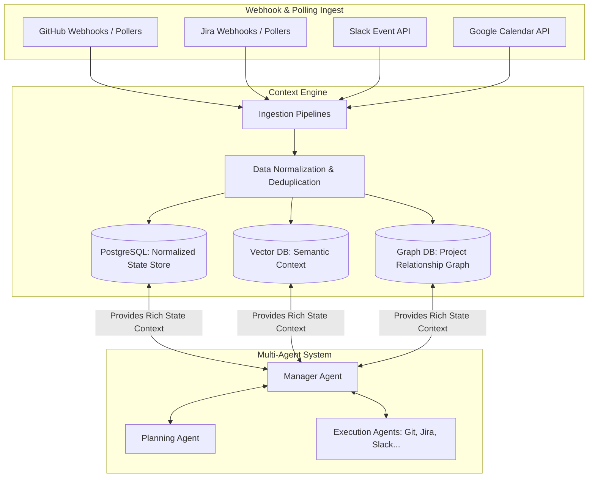
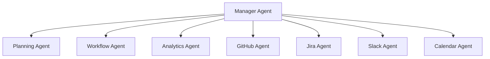
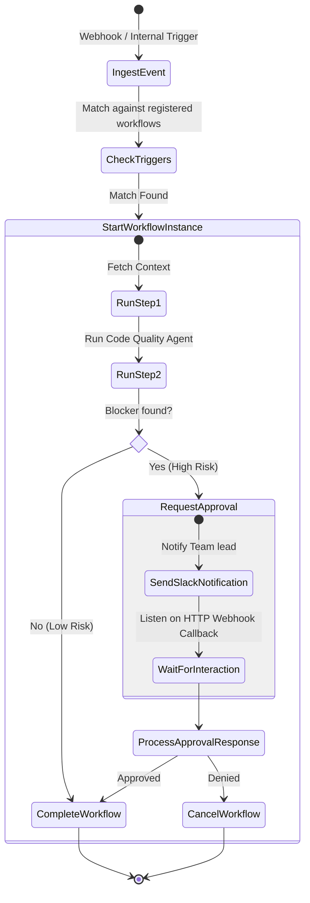

# System Architecture & Design: AI-Powered Technical Project Manager (AI-TPM)

This document details the system design, core modules, data flows, schemas, and orchestration protocols for building an enterprise-grade AI-powered Technical Project Manager. 

Unlike traditional chatbot architectures that process commands sequentially, the AI-TPM is an **event-driven, context-centric autonomous system**. The core design relies on a centralized **Context Engine** that serves as a stateful representation of the organization, with LLMs acting as stateless cognitive processors running workflows and tools.

---

## 1. Core Paradigm: Context-Engine-Centric Design

In typical agent systems, context is gathered ad-hoc by querying databases or search tools on every agent invocation, leading to high latency, context-window saturation, and stale data. 

The AI-TPM reverses this layout:
* **The Context Engine** is the single source of truth for the project state. It continuously aggregates, links, and indexes data from external providers (GitHub, Jira, Slack, Google Calendar) into a stateful, normalized graph model.
* **Stateless Cognitive Loops**: When an agent requires context, it does not query external sources directly. It queries the local Context Engine, which provides a high-fidelity, consolidated view of issues, code commits, schedules, and conversations.



---

## 2. Context Engine Architecture

The Context Engine maintains an active, multi-dimensional representation of all projects. It consists of the following components:

### A. Ingestion Layer
* **Webhook Listeners**: FastAPI endpoints that accept payloads from GitHub, Jira, and Slack. These are written to an write-ahead event log (PostgreSQL `events` table) instantly and processed asynchronously to ensure high availability and prevent webhook timeouts.
* **Periodic Pollers**: Background Celery jobs running at scheduled intervals (e.g., every 5 minutes) using delta-sync strategies (fetching resources modified since `last_synced_at`) to capture events that do not trigger webhooks or recovery runs for missed events.

### B. Normalization Layer
All ingested payloads are transformed into a common internal Domain Model. This decouples the agent logic from external API structures. 

#### Normalized Domain Schemas

```python
class NormalizedEntity(BaseModel):
    id: str  # Format: "urn:<provider>:<entity_type>:<external_id>"
    organization_id: UUID
    project_id: UUID
    provider: Literal["github", "jira", "slack", "google_calendar"]
    raw_payload: dict
    created_at: datetime
    updated_at: datetime

class NormalizedIssue(NormalizedEntity):
    title: str
    description: Optional[str]
    status: str
    priority: str
    assignees: List[str]  # Internal User URNs
    reporter: str
    parent_id: Optional[str]
    labels: List[str]

class NormalizedCommit(NormalizedEntity):
    repository: str
    branch: str
    sha: str
    author: str
    message: str
    diff_summary: Optional[str]
    linked_issues: List[str]  # Issue URNs parsed from message/branch

class NormalizedMessage(NormalizedEntity):
    channel_id: str
    user_id: str
    text: str
    thread_ts: Optional[str]
    mentions: List[str]
    resolved_actions: List[str]

class NormalizedCalendarEvent(NormalizedEntity):
    summary: str
    description: Optional[str]
    start_time: datetime
    end_time: datetime
    attendees: List[str]
    location: Optional[str]
```

### C. Real-Time Synchronization & Graph Linking
Once normalized, entities are saved to PostgreSQL and indexed in a vector store (e.g. pgvector) for semantic querying. They are also linked in a Graph representation:
* **Commits** are linked to **Jira Issues** (via URN mapping: `urn:jira:issue:<key>`).
* **Jira Issues** are linked to **Slack Messages** where they were discussed.
* **Slack Messages** are linked to **Calendar Events** (matching times, users, and context).

This enables agents to answer complex relational questions like: *"Show me the commits and Slack discussions related to the blocker issue discussed in this morning's calendar sync."*

---

## 3. Multi-Agent System

The multi-agent system uses a hierarchical and collaborative topology based on message passing over the Event Bus. 

### Agent Topology



### Agent Roles & Specifications

1. **Manager Agent (Supervisor)**:
   * *Role:* Acts as the central orchestrator and dispatch.
   * *Responsibility:* Receives requests from users or triggers from the Event Bus, queries the Context Engine, decomposes the request into micro-tasks, routes them to execution agents, and synthesizes the final output.
2. **Planning Agent**:
   * *Role:* Technical architect and planner.
   * *Responsibility:* Formulates long-term project plans, handles Gantt chart planning, designs task dependency trees, and estimates story points based on historical team velocity.
3. **GitHub Agent**:
   * *Role:* Codebase observer and manager.
   * *Responsibility:* Triggers PR reviews, checks status of tests/CI, reports code diffs, detects code patterns, and creates repository structures.
4. **Jira Agent**:
   * *Role:* Issue tracker operator.
   * *Responsibility:* Manages epics, sprints, stories, and bugs. Automatically links issues, transitions status, and assigns tasks.
5. **Slack Agent**:
   * *Role:* Communications manager.
   * *Responsibility:* Monitors specific channels, drafts summaries, pushes status alerts, requests approvals from team members, and routes conversations into documentation.
6. **Calendar Agent**:
   * *Role:* Time orchestrator.
   * *Responsibility:* Coordinates meeting agendas, schedules backlog refinements, avoids scheduling conflicts, and schedules human-in-the-loop approvals.
7. **Analytics Agent**:
   * *Role:* Process analyst.
   * *Responsibility:* Calculates metrics (burn-down rate, PR cycle time, defect density, sprint velocity) and provides bottleneck alerts.
8. **Workflow Agent**:
   * *Role:* Process automaton.
   * *Responsibility:* Orchestrates structured multi-agent tasks, tracks states, runs timeout hooks, and escalates unresolved items.

### Communication & Delegation Protocol
Agents communicate via standardized asynchronous JSON envelopes called `AgentMessages` pushed to the Event Bus:

```json
{
  "message_id": "uuid-v4",
  "correlation_id": "uuid-v4",
  "sender": "agent:manager",
  "recipient": "agent:planning",
  "timestamp": "2026-07-17T10:55:00Z",
  "payload_type": "PLAN_REQUEST",
  "payload": {
    "project_id": "urn:project:uuid",
    "goal": "Re-estimate remaining tasks for Sprint 4 given GitHub delay on API schema validation",
    "context_urns": [
      "urn:jira:issue:PROJ-101",
      "urn:github:commit:sha-xyz"
    ]
  }
}
```

* **Coordination Protocol**:
  1. **Supervisor Dispatch**: The Manager Agent posts a job message onto the queue.
  2. **Agent Negotiation**: Agents check their local tool registry capabilities and lock/accept jobs.
  3. **Delegation**: If the Planning Agent needs GitHub structures to estimate a task, it emits a `DELEGATE_REQUEST` to the GitHub Agent, waiting asynchronously on a promise pattern resolved via matching `correlation_id` values.
  4. **State Machine**: The Workflow Agent records all transactions to ensure no messages are lost if an agent crashes mid-execution.

---

## 4. Layered Memory Architecture

To act effectively, the system maintains 5 distinct memory layers, optimizing retrieval speeds and storage cost:

| Memory Layer | Storage Engine | Scope & Description | Key Fields / Data |
| :--- | :--- | :--- | :--- |
| **Short-term Memory** | Redis | Ephemeral workspace for active reasoning loops. Truncated upon completion of a task. | Agent chain of thought, local variables, task planning trees. |
| **Conversation Memory** | Redis + pgvector | Chat history between users and agents. | User-Agent transcripts, user preferences, context reference IDs. |
| **Project Memory** | pgvector + PostgreSQL | State changes, decisions, wiki edits, and architecture decisions of a specific project. | Relational URNs, project wiki, meeting decisions summaries, issue modifications. |
| **Organizational Memory** | PostgreSQL | Global organization rules, coding style guides, CI parameters, credentials, SLA guidelines. | Auth configurations, coding guidelines, developer profile metadata, org directory. |
| **Long-term Memory** | PostgreSQL | Historical analytics, task duration profiles, agent decision history, and learning parameters. | Historical issue timelines, agent execution success/failure logs, estimated vs actual task times. |

---

## 5. Tool Calling Framework

The Tool Calling Framework exposes external APIs to agents safely. It uses a **Modular Tool Registry** with strict parameter enforcement and tenant-aware OAuth token resolution.

```python
# Conceptual Tool Registry Code
from typing import Callable, Dict, Type
from pydantic import BaseModel, Field

class Tool(BaseModel):
    name: str
    description: str
    args_schema: Type[BaseModel]
    func: Callable
    requires_approval: bool = False

class ToolRegistry:
    def __init__(self):
        self._tools: Dict[str, Tool] = {}

    def register(self, name: str, description: str, args_schema: Type[BaseModel], requires_approval: bool = False):
        def decorator(func: Callable):
            self._tools[name] = Tool(
                name=name,
                description=description,
                args_schema=args_schema,
                func=func,
                requires_approval=requires_approval
            )
            return func
        return decorator

    def get_tool(self, name: str) -> Tool:
        return self._tools[name]

registry = ToolRegistry()

# Usage Example:
class CreateJiraIssueArgs(BaseModel):
    project_key: str = Field(..., description="The key of the Jira project")
    summary: str = Field(..., description="Short title of the task")
    description: str = Field(None, description="Detailed description")
    issue_type: str = Field("Task", description="Task, Story, Bug, Epic")

@registry.register(
    name="create_jira_issue",
    description="Creates a new task in Jira issue tracker",
    args_schema=CreateJiraIssueArgs,
    requires_approval=True  # Mutating tools require Human-In-The-Loop confirmation
)
async def create_jira_issue(credentials: dict, args: CreateJiraIssueArgs):
    # Dynamic runtime execution injecting context-specific tokens
    pass
```

### Context Security & Tenant Injection
* Agents **never** see raw OAuth secrets or API keys.
* At runtime, the agent engine interceptor fetches the current organization/user OAuth session from the database, builds an authenticated client wrapper, and injects it directly into the tool execution context.

---

## 6. Event-Driven Workflow Engine

The Workflow Engine controls complex, multi-step actions using Directed Acyclic Graphs (DAGs) representing workflows.



### Key Capabilities
* **Dynamic Escalation**: If a developer does not respond to a Slack approval request within 2 hours, the engine triggers a Calendar check to find when they are next active, and schedules a follow-up or escalates the task to the project manager.
* **Human-in-the-Loop Hooks**: Outgoing tool actions containing mutated states (e.g. `create_pr`, `close_jira_ticket`) queue up an approval item and publish a notification. The workflow execution enters a `SUSPENDED` state, storing its execution register in PostgreSQL, resuming immediately once the approval webhook fires.

---

## 7. Event Bus Architecture

The Event Bus acts as the central messaging nervous system. We select **Redis Pub/Sub** for transient routing and real-time frontend notifications (via WebSockets), coupled with **PostgreSQL Transactional Outbox Pattern** for reliable, guarantee-of-delivery event storage.

```
                  ┌───────────────────────┐
                  │    Ingestion Engine   │
                  └───────────┬───────────┘
                              │ Writes Event
                              ▼
                  ┌───────────────────────┐
                  │ PostgreSQL Event Table│
                  └───────────┬───────────┘
                              │ Commits Transaction
                              ▼
                  ┌───────────────────────┐
                  │   Debezium/CDC / DB   │
                  │   Trigger Publisher   │
                  └───────────┬───────────┘
                              │ Broadcasts
                              ▼
        ┌──────────────────────┼──────────────────────┐
        ▼                      ▼                      ▼
┌──────────────┐       ┌──────────────┐       ┌──────────────┐
│  Redis Pub   │       │ Celery Tasks │       │ WebSockets   │
│  (Transient) │       │ (Workers)    │       │ (Frontend)   │
└──────────────┘       └──────────────┘       └──────────────┘
```

### Event Structuring & Routing Keys
Every event contains a routing key structure: `<org_id>.<project_id>.<domain>.<action>`
* *Example:* `org1.projA.github.pr_opened`
* Subscribers filter events dynamically utilizing glob/pattern matching subscriptions.

---

## 8. Backend Folder Structure

We organize the FastAPI repository by decoupling domain entities and core infrastructure adapters, following the Hexagonal principles detailed below:

```
backend/
├── app/
│   ├── __init__.py
│   ├── main.py                       # FastAPI startup, CORS, routing registration
│   ├── api/                          # HTTP & WebSocket Delivery Layer
│   │   ├── __init__.py
│   │   ├── deps.py                   # Dependency Injection providers (DB, Auth, Current User)
│   │   ├── websockets/
│   │   │   ├── __init__.py
│   │   │   └── manager.py            # Global WebSocket listener registry
│   │   └── v1/
│   │       ├── api.py                # Main v1 router
│   │       └── endpoints/
│   │           ├── auth.py           # OAuth endpoints for Third Parties
│   │           ├── agents.py         # Agent execution triggers & logs
│   │           ├── workflows.py      # Workflow configuration & active instances
│   │           ├── context.py        # Context engine inspection tools
│   │           └── metrics.py        # Analytics data points
│   ├── core/                         # Core App Configuration
│   │   ├── __init__.py
│   │   ├── config.py                 # Pydantic Settings
│   │   ├── security.py               # Token creation, encryption for OAuth credentials
│   │   └── database.py               # Database Engine session pool
│   ├── context/                      # Context Aggregation Engine
│   │   ├── __init__.py
│   │   ├── normalizer.py             # Normalization adapters for external data
│   │   ├── aggregator.py             # Builds current unified project state
│   │   └── graph.py                  # Relational links between Github, Jira, Slack, Calendar
│   ├── db/                           # Relational Persistence Models
│   │   ├── __init__.py
│   │   ├── base.py                   # Collection of database models for Alembic
│   │   ├── base_class.py             # Declarative base class
│   │   └── migrations/               # Alembic folder
│   ├── agents/                       # Agent Execution Framework
│   │   ├── __init__.py
│   │   ├── supervisor.py             # Manager Agent orchestration code
│   │   ├── runner.py                 # Standard Execution runtime
│   │   └── definitions/              # Agent prompt logic and specialization
│   │       ├── planning.py
│   │       ├── developer.py
│   │       ├── communicator.py
│   │       └── analyst.py
│   ├── tools/                        # Dynamic Tool Calling Layer
│   │   ├── __init__.py
│   │   ├── registry.py               # Registry decorator and schema collector
│   │   └── definitions/              # Built-in Tool interfaces
│   │       ├── github_tools.py
│   │       ├── jira_tools.py
│   │       ├── slack_tools.py
│   │       └── calendar_tools.py
│   ├── memory/                       # Modular Memory Architecture
│   │   ├── __init__.py
│   │   ├── vector.py                 # Vector DB / pgvector interface
│   │   ├── cache.py                  # Short term memory wrapper (Redis)
│   │   └── repository.py             # Relational historical storage (PostgreSQL)
│   ├── workflows/                    # Automation Engine
│   │   ├── __init__.py
│   │   ├── engine.py                 # DAG executor state-machine
│   │   ├── triggers.py               # Event parsing rules
│   │   └── actions.py                # Executable steps
│   └── integrations/                 # Raw Network Adapters
│       ├── __init__.py
│       ├── github_client.py
│       ├── jira_client.py
│       ├── slack_client.py
│       └── google_client.py
├── alembic.ini
├── requirements.txt
└── Dockerfile
```

---

## 9. Database Design (PostgreSQL DDL)

Below are the production-ready PostgreSQL relational schemas with foreign key references, indexes, and timezone handling.

```sql
-- Enable necessary extensions
CREATE EXTENSION IF NOT EXISTS "uuid-ossp";
CREATE EXTENSION IF NOT EXISTS "pgcrypto";
CREATE EXTENSION IF NOT EXISTS "vector"; -- Used for embedding dimensions

-- =========================================================================
-- 1. Organizations & Tenants
-- =========================================================================
CREATE TABLE organizations (
    id UUID PRIMARY KEY DEFAULT uuid_generate_v4(),
    name VARCHAR(255) NOT NULL,
    domain VARCHAR(255) UNIQUE,
    created_at TIMESTAMP WITH TIME ZONE DEFAULT CURRENT_TIMESTAMP,
    updated_at TIMESTAMP WITH TIME ZONE DEFAULT CURRENT_TIMESTAMP
);

-- =========================================================================
-- 2. Users Table
-- =========================================================================
CREATE TABLE users (
    id UUID PRIMARY KEY DEFAULT uuid_generate_v4(),
    organization_id UUID NOT NULL REFERENCES organizations(id) ON DELETE CASCADE,
    email VARCHAR(255) NOT NULL UNIQUE,
    full_name VARCHAR(255) NOT NULL,
    avatar_url TEXT,
    is_active BOOLEAN DEFAULT TRUE,
    role VARCHAR(50) DEFAULT 'member',
    created_at TIMESTAMP WITH TIME ZONE DEFAULT CURRENT_TIMESTAMP,
    updated_at TIMESTAMP WITH TIME ZONE DEFAULT CURRENT_TIMESTAMP
);

CREATE INDEX idx_users_email ON users(email);
CREATE INDEX idx_users_org ON users(organization_id);

-- =========================================================================
-- 3. Projects Table
-- =========================================================================
CREATE TABLE projects (
    id UUID PRIMARY KEY DEFAULT uuid_generate_v4(),
    organization_id UUID NOT NULL REFERENCES organizations(id) ON DELETE CASCADE,
    name VARCHAR(255) NOT NULL,
    description TEXT,
    jira_project_key VARCHAR(50),
    github_repo_name VARCHAR(255),
    created_at TIMESTAMP WITH TIME ZONE DEFAULT CURRENT_TIMESTAMP,
    updated_at TIMESTAMP WITH TIME ZONE DEFAULT CURRENT_TIMESTAMP
);

CREATE INDEX idx_projects_org ON projects(organization_id);

-- =========================================================================
-- 4. Integrations Table (OAuth credential storage encrypted at rest)
-- =========================================================================
CREATE TABLE integrations (
    id UUID PRIMARY KEY DEFAULT uuid_generate_v4(),
    organization_id UUID NOT NULL REFERENCES organizations(id) ON DELETE CASCADE,
    provider VARCHAR(50) NOT NULL, -- 'github', 'jira', 'slack', 'google_calendar'
    access_token TEXT NOT NULL,     -- Encrypted text
    refresh_token TEXT,             -- Encrypted text
    scopes TEXT[],
    token_expires_at TIMESTAMP WITH TIME ZONE,
    provider_metadata JSONB DEFAULT '{}',
    is_active BOOLEAN DEFAULT TRUE,
    last_synced_at TIMESTAMP WITH TIME ZONE,
    created_at TIMESTAMP WITH TIME ZONE DEFAULT CURRENT_TIMESTAMP,
    updated_at TIMESTAMP WITH TIME ZONE DEFAULT CURRENT_TIMESTAMP,
    UNIQUE(organization_id, provider)
);

CREATE INDEX idx_integrations_org_provider ON integrations(organization_id, provider);

-- =========================================================================
-- 5. Context Snapshots (Unified Project State Graph snapshots)
-- =========================================================================
CREATE TABLE context_snapshots (
    id UUID PRIMARY KEY DEFAULT uuid_generate_v4(),
    project_id UUID NOT NULL REFERENCES projects(id) ON DELETE CASCADE,
    snapshot_timestamp TIMESTAMP WITH TIME ZONE DEFAULT CURRENT_TIMESTAMP,
    entities_count INTEGER NOT NULL,
    state_payload JSONB NOT NULL, -- Normalized representation of current state graph
    embedding vector(1536)        -- High-level semantic state summary vector
);

CREATE INDEX idx_context_snapshots_project ON context_snapshots(project_id, snapshot_timestamp DESC);

-- =========================================================================
-- 6. Event Log (Write-Ahead log for Event Bus)
-- =========================================================================
CREATE TABLE events (
    id UUID PRIMARY KEY DEFAULT uuid_generate_v4(),
    organization_id UUID NOT NULL REFERENCES organizations(id) ON DELETE CASCADE,
    project_id UUID REFERENCES projects(id) ON DELETE SET NULL,
    routing_key VARCHAR(255) NOT NULL, -- e.g. 'org.proj.github.pr_opened'
    payload JSONB NOT NULL,
    processed BOOLEAN DEFAULT FALSE,
    created_at TIMESTAMP WITH TIME ZONE DEFAULT CURRENT_TIMESTAMP
);

CREATE INDEX idx_events_routing ON events(routing_key);
CREATE INDEX idx_events_unprocessed ON events(created_at) WHERE processed = FALSE;

-- =========================================================================
-- 7. Workflows Table
-- =========================================================================
CREATE TABLE workflows (
    id UUID PRIMARY KEY DEFAULT uuid_generate_v4(),
    organization_id UUID NOT NULL REFERENCES organizations(id) ON DELETE CASCADE,
    name VARCHAR(255) NOT NULL,
    trigger_event VARCHAR(255) NOT NULL, -- Event routing key that launches workflow
    dag_definition JSONB NOT NULL,      -- Workflow execution structure
    is_active BOOLEAN DEFAULT TRUE,
    created_at TIMESTAMP WITH TIME ZONE DEFAULT CURRENT_TIMESTAMP,
    updated_at TIMESTAMP WITH TIME ZONE DEFAULT CURRENT_TIMESTAMP
);

-- =========================================================================
-- 8. Workflow Executions Table
-- =========================================================================
CREATE TABLE workflow_executions (
    id UUID PRIMARY KEY DEFAULT uuid_generate_v4(),
    workflow_id UUID NOT NULL REFERENCES workflows(id) ON DELETE CASCADE,
    status VARCHAR(50) NOT NULL DEFAULT 'running', -- 'running', 'suspended', 'completed', 'failed'
    current_step VARCHAR(255),
    execution_state JSONB NOT NULL DEFAULT '{}',  -- Contains intermediate variable values
    created_at TIMESTAMP WITH TIME ZONE DEFAULT CURRENT_TIMESTAMP,
    completed_at TIMESTAMP WITH TIME ZONE
);

CREATE INDEX idx_workflow_executions_status ON workflow_executions(status);

-- =========================================================================
-- 9. Agent Memory Table
-- =========================================================================
CREATE TABLE agent_memories (
    id UUID PRIMARY KEY DEFAULT uuid_generate_v4(),
    organization_id UUID NOT NULL REFERENCES organizations(id) ON DELETE CASCADE,
    project_id UUID REFERENCES projects(id) ON DELETE SET NULL,
    memory_type VARCHAR(50) NOT NULL, -- 'long_term', 'project_memory', 'organizational'
    content TEXT NOT NULL,
    metadata JSONB DEFAULT '{}',
    embedding vector(1536),           -- Vector representation for semantic matches
    created_at TIMESTAMP WITH TIME ZONE DEFAULT CURRENT_TIMESTAMP
);

CREATE INDEX idx_agent_memories_vector ON agent_memories USING ivfflat (embedding vector_cosine_ops) WITH (lists = 100);

-- =========================================================================
-- 10. Analytics Table
-- =========================================================================
CREATE TABLE analytics_metrics (
    id UUID PRIMARY KEY DEFAULT uuid_generate_v4(),
    project_id UUID NOT NULL REFERENCES projects(id) ON DELETE CASCADE,
    metric_name VARCHAR(100) NOT NULL, -- 'pr_cycle_time', 'sprint_velocity', 'defect_rate'
    metric_value NUMERIC(12, 4) NOT NULL,
    dimension_metadata JSONB DEFAULT '{}', -- e.g., {'developer_id': '...', 'sprint_id': '...'}
    recorded_at TIMESTAMP WITH TIME ZONE DEFAULT CURRENT_TIMESTAMP
);

CREATE INDEX idx_analytics_metrics_name_date ON analytics_metrics(project_id, metric_name, recorded_at DESC);

-- =========================================================================
-- 11. Notifications Table
-- =========================================================================
CREATE TABLE notifications (
    id UUID PRIMARY KEY DEFAULT uuid_generate_v4(),
    user_id UUID NOT NULL REFERENCES users(id) ON DELETE CASCADE,
    title VARCHAR(255) NOT NULL,
    body TEXT NOT NULL,
    is_read BOOLEAN DEFAULT FALSE,
    action_url TEXT,
    created_at TIMESTAMP WITH TIME ZONE DEFAULT CURRENT_TIMESTAMP
);

CREATE INDEX idx_notifications_user_unread ON notifications(user_id) WHERE is_read = FALSE;
```

---

## 10. Frontend Architecture (Next.js 15 App Router)

The frontend is structured to expose data stream visualizations, dashboard metrics, real-time activity, and custom agent run monitoring panels.

### Architecture Structure (Frontend)

```
frontend/
├── app/
│   ├── layout.tsx                     # Global providers (Auth, Theme, React Query, WebSockets)
│   ├── page.tsx                       # Landing / Portal Authentication (OAuth buttons)
│   └── dashboard/
│       ├── layout.tsx                 # Main layout featuring Collapsible Sidebar navigation
│       ├── page.tsx                   # Overview KPI blocks (Velocities, Active Blocker warnings)
│       ├── agents/
│       │   ├── page.tsx               # Grid showing active agent runs
│       │   └── [agentId]/
│       │       └── page.tsx           # Detailed execution log explorer (Chain of Thought visualization)
│       ├── integrations/
│       │   └── page.tsx               # Integration status tiles (Connect Slack, Jira, GitHub)
│       ├── tasks/
│       │   └── page.tsx               # Consolidated Timeline / Interactive Gantt / Board
│       └── workflows/
│           ├── page.tsx               # Drag-and-drop Workflow builder console
│           └── execution/[runId]/
│               └── page.tsx           # Visual DAG runner steps (Green/Yellow/Red highlights)
├── components/
│   ├── ui/                            # Pure UI Elements (Button, Table, Card, Dialog)
│   │   ├── button.tsx
│   │   ├── dialog.tsx
│   │   └── toast.tsx
│   ├── dashboard/                     # Widget implementations
│   │   ├── activity-stream.tsx        # Real-time WebSocket event notifications feed
│   │   ├── velocity-chart.tsx         # Recharts integration showing sprint metrics
│   │   └── blocker-alerts.tsx         # Highlight block alerts detected by Analytics Agent
│   └── workflow-builder/              # Interactive flow builder elements
├── hooks/
│   ├── use-websocket.ts               # Resilient, reconnecting WebSocket client hook
│   └── use-api-query.ts               # Custom TanStack query wrap containing request retry logic
├── lib/
│   ├── api-client.ts                  # Axios client wrapper handling automated auth header inclusion
│   └── utils.ts                       # Tailwind merge helpers, currency formats, timezone conversions
└── types/
    └── index.ts                       # Shared type system definitions
```

---

## 11. Architectural Decision Records (ADRs)

### ADR 001: Context-Engine-Centric vs. Agent-Ad-hoc-Querying
* **Context**: Agent execution loops need comprehensive information (e.g., ticket data, commit messages, Slack logs) to make accurate planning decisions. Querying APIs directly in LLM toolchains is slow, rate-limits external providers, and fails when connections are flaky.
* **Decision**: All external integration sync pipelines write directly to the central **Context Engine**. Agents only inspect local databases, vector indexes, and unified context graphs.
* **Consequence**: Drastically reduced agent execution latency (from >20 seconds down to <1 second for context collection), immune to external API rate limits during execution, and full transactional isolation of agent reasoning.

### ADR 002: Event Sourcing & Write-Ahead Event Table
* **Context**: We need to process high-volume webhooks from GitHub/Slack without blocking network requests or missing critical system updates.
* **Decision**: FastAPI acts as a lightweight ingestion worker. When it receives a webhook, it inserts the raw JSON and routing key into the PostgreSQL `events` table (Write-Ahead Log) within a transaction, returning an immediate `202 Accepted`. A background pipeline processes these events sequentially/parallelized depending on domain partitions.
* **Consequence**: High scalability, resilience to downtime (we can re-run event processing from the database at any time), and built-in system audits.

### ADR 003: Stateless Agent Architecture with State Externalization
* **Context**: AI agents run multi-step planning loops that can take minutes to complete or days to await human approvals. Keeping agent execution state in application memory makes system scaling and container restarts difficult.
* **Decision**: Agents are designed as stateless execution engines. Every reasoning cycle reads state from PostgreSQL (`workflow_executions` and `agent_memories`), runs a single iteration, updates the database, and exits.
* **Consequence**: The application remains fully horizontal-scalable (FastAPI/Celery instances can be added/removed dynamically without losing agent state). Workflows can pause indefinitely for human-in-the-loop approvals without consuming active memory.
